# Documentation

This documentation is the operating manual and learning path for Social Research Probe. Read it in order if you are new. Use the reference pages when you are changing a specific layer.

The current concrete platform is YouTube. The architecture is platform-oriented, so the code separates platform stages from reusable services, technology adapters, scoring, analysis, reporting, cache, config, and persistence.

## Learning Path

| Step | Read | What you learn |
| --- | --- | --- |
| 1 | [Objective](objective.md) | What problem the project solves and what a good run should answer. |
| 2 | [How it works](how-it-works.md) | The end-to-end runtime flow from CLI input to report/export/database output. |
| 3 | [Installation](installation.md) | Python environment, package install, data directory, secrets, and optional providers. |
| 4 | [Usage](usage.md) | Day-to-day command workflow and how to read a run. |
| 5 | [Configuration](configuration.md) | Config files, secrets, gates, runners, and provider controls. |
| 6 | [Data directory](data-directory.md) | Where config, state, cache, reports, exports, charts, and SQLite data live. |
| 7 | [Architecture](architecture.md) | Package boundaries and the Platform -> Service -> Technology contract. |
| 8 | [Module reference](module-reference.md) | Where to look before editing code. |
| 9 | [Python language guide](python-language-guide.md) | Python fundamentals and repository-specific Python patterns. |

## User Reference

| Topic | Document |
| --- | --- |
| Command examples | [Commands](commands.md) |
| API keys and cost control | [API costs and keys](api-costs-and-keys.md) |
| LLM runner setup | [LLM runners](llm-runners.md) |
| Source classification | [Source classification](classifying.md) |
| Claim corroboration | [Corroboration](corroboration.md) |
| Scoring model | [Scoring](scoring.md) |
| Statistics | [Statistics](statistics.md) |
| Charts | [Charts](charts.md) |
| Summary quality | [Summary quality](summary-quality-report.md) |
| Synthesis authoring | [Synthesis authoring](synthesis-authoring.md) |
| Security | [Security](security.md) |
| Runtime dependencies | [Runtime dependencies](runtime-dependencies.md) |
| Model applicability | [Model applicability](model-applicability.md) |
| Cost optimization | [Cost optimization](cost-optimization.md) |

## Developer Reference

| Topic | Document |
| --- | --- |
| Design patterns | [Design patterns](design-patterns.md) |
| Root files | [Root files](root-files.md) |
| Testing | [Testing](testing.md) |
| LLM reliability harness | [LLM reliability harness](llm-reliability-harness.md) |
| Add a platform | [Adding a platform](adding-a-platform.md) |
| Add a service | [Adding a service](adding-a-service.md) |
| Add a technology | [Adding a technology](adding-a-technology.md) |

## Diagram Index

Every rendered SVG under `docs/diagrams/` has a matching Mermaid source under `docs/diagrams/src/`.

| Diagram | Used for |
| --- | --- |
|  | System boundary and external actors. |
|  | Source package responsibilities. |
|  | YouTube research data path. |
|  | Runtime call order. |
|  | Parallel stage behavior. |
|  | Config, secrets, and gates. |
|  | Cache and provider budget controls. |
|  | Claim checking. |
|  | LLM search contract. |
|  | Runner fallback and health checks. |
|  | Evaluation flow. |
|  | Summary generation and quality checks. |
|  | Test strategy. |
|  | Release workflow. |
|  | Future platform extension shape. |
|  | Platform boundary. |
|  | Platform extension steps. |
|  | Strategy pattern. |
|  | Adapter pattern. |
|  | Registry pattern. |
|  | Pipeline pattern. |
|  | Test seam. |
|  | Ranking math. |
|  | Data directory storage layout. |
|  | Python primer. |
|  | Service execution lifecycle. |
|  | CLI overview. |
|  | Secrets and trust boundaries. |
|  | Output artifacts. |
|  | Architecture choices. |
|  | Chart data flow. |
|  | Statistics data flow. |
|  | Reading statistics. |
|  | Provider and runner cost boundaries. |
|  | Platform/Service/Technology flow. |
|  | Adding a service. |
|  | Source classification. |
|  | Audio narration. |
