[Back to docs index](README.md)

# Adding A Platform



A platform adapter should fetch raw items and engagement metrics, then hand them to the shared pipeline concepts. The current concrete platform is YouTube, but YouTube is not the product boundary. The architecture is meant to support additional public sources such as TikTok, Instagram, X, web search, RSS, forums, and other platforms.

The job of a platform adapter is to translate source-specific data into the internal research shape. After that translation, the shared services should be able to score, analyze, summarize, corroborate, chart, and report without caring where the item came from.

## Contract

A platform needs:

| Part | Responsibility |
| --- | --- |
| Fetch stage | Find candidate items for a topic. |
| Raw item shape | Provide id, url, title, author/channel, timestamps, metrics, excerpts. |
| Engagement metrics | Provide velocity, engagement ratio, and cross-channel repetition when available. |
| Config defaults | Add platform limits and cache TTLs. |
| Tests | Fake data, parser coverage, stage behavior, and report integration. |

The contract should be stable before adding a new source. A platform can have source-specific fields, but the shared pipeline needs a common minimum: an item id, title, URL, source name, timestamps when available, text or transcript material when available, and numeric features that can support scoring.


## Why this boundary

The rest of the system should not know which source produced an item. Once the adapter supplies normalized items and metrics, scoring, enrichment, analysis, and reporting can stay shared.

Without this boundary, each service would grow platform-specific branches. Charting would need to know about TikTok views versus YouTube views. Corroboration would need to know platform URL formats. Synthesis would need custom logic for every source. The adapter boundary keeps those differences close to the source integration.

## Implementation checklist

| Step | What to add | What to verify |
| --- | --- | --- |
| 1 | Platform config defaults. | The platform can be enabled, limited, and cached independently. |
| 2 | Fetch adapter. | Raw API/search results become deterministic internal items. |
| 3 | Normalization helpers. | Missing source fields become safe defaults rather than crashes. |
| 4 | Pipeline registration. | `srp research PLATFORM TOPIC PURPOSES` can route to the new platform. |
| 5 | Fake data seam. | Tests can run without network access or provider credentials. |
| 6 | Report integration. | Reports identify the source platform and preserve item URLs. |

Start small. A new platform does not need every enrichment feature on day one. It should first fetch, normalize, score, and report. Transcript-like enrichment, platform-specific metrics, and richer charts can follow once the base contract is stable.

## Concrete Example: Add A Web Search Platform

The examples below use `web` as the new platform name. The same structure works for TikTok, Instagram, X, RSS, forums, or any future source. Only the sourcing technology and normalization rules change.

This is the current integration shape:

```text
user command
  -> platform orchestrator
  -> concrete platform pipeline
  -> fetch stage
  -> registered platform client
  -> shared score / stats / charts / synthesis / report stages
```

The important rule is that platform-specific code should end after the fetch and normalization boundary. Once the platform returns `RawItem` objects and `EngagementMetrics`, the rest of the pipeline should look like the YouTube pipeline.

## 1. Add The Sourcing Client

Create a client under `social_research_probe/services/sourcing/web.py`. This client is responsible for calling the external source, parsing the raw response, and returning normalized `RawItem` objects.

```python
"""WebSearchConnector: SearchClient implementation for web sourcing."""

from __future__ import annotations

from datetime import UTC, datetime
from typing import ClassVar

from social_research_probe.config import load_active_config
from social_research_probe.platforms.base import (
    EngagementMetrics,
    FetchLimits,
    RawItem,
    SearchClient,
)
from social_research_probe.platforms.registry import register
from social_research_probe.utils.core.types import AdapterConfig, JSONObject


@register
class WebSearchConnector(SearchClient):
    """Bridges a web search technology to the platform pipeline protocol."""

    name: ClassVar[str] = "web"

    def __init__(self, config: AdapterConfig) -> None:
        self.config = config
        platform = load_active_config().platform_defaults("web")
        self.default_limits = FetchLimits(
            max_items=int(platform.get("max_items", FetchLimits().max_items)),
            recency_days=platform.get("recency_days", FetchLimits().recency_days),
        )

    def health_check(self) -> bool:
        return True

    def find_by_topic(self, topic: str, limits: FetchLimits) -> list[RawItem]:
        raw_results = self._search_web(topic, limits)
        return [self._to_raw_item(result) for result in raw_results]

    async def fetch_item_details(self, items: list[RawItem]) -> list[RawItem]:
        return items

    def _search_web(self, topic: str, limits: FetchLimits) -> list[JSONObject]:
        # Replace this with a technology module call, for example:
        # return search_web(topic, max_items=limits.max_items)
        return [
            {
                "id": "example-1",
                "url": "https://example.com/research-note",
                "title": f"Research note about {topic}",
                "source": "Example Source",
                "published_at": "2026-04-01T00:00:00Z",
                "snippet": "A short excerpt from the search result.",
            }
        ][: limits.max_items]

    def _to_raw_item(self, result: JSONObject) -> RawItem:
        published_raw = str(result.get("published_at") or "")
        try:
            published_at = datetime.fromisoformat(
                published_raw.replace("Z", "+00:00")
            ).astimezone(UTC)
        except ValueError:
            published_at = datetime.now(UTC)

        return RawItem(
            id=str(result.get("id") or result.get("url") or ""),
            url=str(result.get("url") or ""),
            title=str(result.get("title") or "Untitled result"),
            author_id=str(result.get("source") or "unknown"),
            author_name=str(result.get("source") or "Unknown source"),
            published_at=published_at,
            metrics={},
            text_excerpt=str(result.get("snippet") or ""),
            thumbnail=None,
            extras={"source_type": "web_search"},
        )


def compute_engagement_metrics(items: list[RawItem]) -> list[EngagementMetrics]:
    """Return neutral metrics when the platform does not expose engagement counts."""
    return [
        EngagementMetrics(
            views=None,
            likes=None,
            comments=None,
            upload_date=item.published_at,
            view_velocity=None,
            engagement_ratio=None,
            comment_velocity=None,
            cross_channel_repetition=0.0,
            raw={"source_type": item.extras.get("source_type")},
        )
        for item in items
    ]
```

Why use `RawItem` instead of dictionaries? A dataclass gives the pipeline a stable shape. If every platform returns a different dictionary, the scoring, charting, and reporting stages must guess field names and handle many special cases. `RawItem` keeps platform-specific parsing inside the adapter.

Why allow `None` metrics? Some platforms do not expose views, likes, or comments. `None` means “not available.” It is better than pretending the value is zero, because zero means the platform reported a real count of zero.

## 2. Add The Platform Pipeline

Create `social_research_probe/platforms/web/pipeline.py`. Start with fetch, score, assemble, and report. Then add transcript, summary, corroboration, statistics, charts, synthesis, structured synthesis, and narration when the platform has enough data to benefit from them.

```python
"""Web research platform: concrete stage implementations and pipeline runner."""

from __future__ import annotations

import asyncio
from importlib import import_module

from social_research_probe.platforms.base import BaseResearchPlatform, BaseStage
from social_research_probe.platforms.state import PipelineState
from social_research_probe.services.reporting.writer import write_final_report
from social_research_probe.services.sourcing.web import compute_engagement_metrics
from social_research_probe.utils.display.progress import log_with_time


class WebFetchStage(BaseStage):
    """Fetch web search results and normalize them into RawItem objects."""

    def stage_name(self) -> str:
        return "fetch"

    @log_with_time("[srp] web/fetch: execute")
    async def execute(self, state: PipelineState) -> PipelineState:
        if not self._is_enabled(state):
            state.set_stage_output("fetch", {"items": [], "engagement_metrics": []})
            return state

        from social_research_probe.platforms.registry import get_client

        import_module("social_research_probe.services.sourcing.web")
        connector = get_client("web", state.platform_config)
        topic = str(state.inputs.get("topic", ""))

        raw_items = await asyncio.to_thread(
            connector.find_by_topic,
            topic,
            connector.default_limits,
        )
        items = await connector.fetch_item_details(raw_items)
        metrics = compute_engagement_metrics(items)
        state.set_stage_output("fetch", {"items": items, "engagement_metrics": metrics})
        return state


class WebScoreStage(BaseStage):
    """Score fetched web items using the shared scoring service."""

    def stage_name(self) -> str:
        return "score"

    @log_with_time("[srp] web/score: execute")
    async def execute(self, state: PipelineState) -> PipelineState:
        fetch = state.get_stage_output("fetch")
        items = list(fetch.get("items", []))
        limit = int(state.platform_config.get("enrich_top_n", 5))

        if not self._is_enabled(state) or not items:
            state.set_stage_output("score", {"all_scored": items, "top_n": items[:limit]})
            return state

        from social_research_probe.services.scoring.compute import score_items

        scored = score_items(items, fetch.get("engagement_metrics", []), None)
        state.set_stage_output("score", {"all_scored": scored, "top_n": scored[:limit]})
        return state


class WebAssembleStage(BaseStage):
    """Build the final report packet from fetch and score outputs."""

    def stage_name(self) -> str:
        return "assemble"

    @log_with_time("[srp] web/assemble: execute")
    async def execute(self, state: PipelineState) -> PipelineState:
        if not self._is_enabled(state):
            return state

        fetch = state.get_stage_output("fetch")
        score = state.get_stage_output("score")
        top_n = score.get("top_n", [])

        from social_research_probe.services.synthesizing.formatter import build_report

        report = build_report(
            topic=str(state.inputs.get("topic", "")),
            platform="web",
            purpose_set=list(state.inputs.get("purpose_names", [])),
            items_top_n=top_n,
            source_validation_summary={},
            platform_engagement_summary="web search results do not expose shared engagement counts",
            evidence_summary=f"fetched {len(fetch.get('items', []))} web results",
            stats_summary={},
            chart_captions=[],
            chart_takeaways=[],
            warnings=[],
        )
        state.set_stage_output("assemble", {"report": report})
        state.outputs["report"] = report
        return state


class WebReportStage(BaseStage):
    """Write the final report to disk."""

    def stage_name(self) -> str:
        return "report"

    @log_with_time("[srp] web/report: execute")
    async def execute(self, state: PipelineState) -> PipelineState:
        if not self._is_enabled(state):
            return state
        report = state.outputs.get("report", {})
        report["report_path"] = write_final_report(report, allow_html=False)
        state.outputs["report"] = report
        return state


class WebPipeline(BaseResearchPlatform):
    """Orchestrates the first useful version of the web platform."""

    def stages(self) -> list[list[BaseStage]]:
        return [
            [WebFetchStage()],
            [WebScoreStage()],
            [WebAssembleStage()],
            [WebReportStage()],
        ]

    @log_with_time("[srp] web/pipeline: run")
    async def run(self, state: PipelineState) -> PipelineState:
        for group in self.stages():
            if len(group) == 1:
                state = await group[0].execute(state)
            else:
                await asyncio.gather(*(stage.execute(state) for stage in group))
        return state
```

This example intentionally begins with a small pipeline. Copying every YouTube stage on day one is usually the wrong tradeoff. A new platform should first prove that it can fetch, normalize, score, and write a report. After that works, add optional enrichment stages one at a time.

## 3. Export The Pipeline

Add a package marker:

```python
# social_research_probe/platforms/web/__init__.py
"""Web platform pipeline."""
```

Then register the concrete pipeline in `social_research_probe/platforms/__init__.py`:

```python
def _get_concrete_pipelines() -> dict[str, type]:
    global _concrete_pipelines
    if _concrete_pipelines is None:
        import social_research_probe.services.sourcing.youtube
        import social_research_probe.services.sourcing.web
        from social_research_probe.platforms.web.pipeline import WebPipeline
        from social_research_probe.platforms.youtube.pipeline import YouTubePipeline

        _concrete_pipelines = {
            "youtube": YouTubePipeline,
            "web": WebPipeline,
        }
    return _concrete_pipelines
```

Why import the sourcing module here? The `@register` decorator runs when the module is imported. If `social_research_probe.services.sourcing.web` is never imported, `get_client("web", ...)` will not know the client exists.

## 4. Add Config Defaults

Add platform defaults and stage gates in `social_research_probe/config.py` under `DEFAULT_CONFIG`.

```python
DEFAULT_CONFIG = {
    "platforms": {
        "youtube": {
            "recency_days": 90,
            "max_items": 20,
            "enrich_top_n": 5,
            "cache_ttl_search_hours": 6,
            "cache_ttl_channel_hours": 24,
        },
        "web": {
            "recency_days": 30,
            "max_items": 20,
            "enrich_top_n": 5,
            "cache_ttl_search_hours": 6,
        },
    },
    "stages": {
        "youtube": {
            # existing YouTube flags
        },
        "web": {
            "fetch": True,
            "score": True,
            "assemble": True,
            "report": True,
        },
    },
}
```

Also update `config.toml.example` so users can discover the new settings:

```toml
[platforms.web]
recency_days = 30
max_items = 20
enrich_top_n = 5
cache_ttl_search_hours = 6

[stages.web]
fetch = true
score = true
assemble = true
report = true
```

If a stage is missing from `[stages.web]`, `Config.stage_enabled("web", "stage_name")` currently defaults to `True` for unknown stage keys on known platforms. It is still better to list the stages explicitly because configuration should document the runtime shape.

## 5. Use The New Platform From The CLI

Once the platform is registered in `PIPELINES`, the existing research command parser can route to it.

```bash
srp research web "agentic search" "market-research"
```

Expected shape:

```text
[srp] web/pipeline: run
[srp] web/fetch: execute
[srp] web/score: execute
[srp] web/assemble: execute
[srp] web/report: execute
```

The report packet should include:

```json
{
  "topic": "agentic search",
  "platform": "web",
  "purpose_set": ["market-research"],
  "items_top_n": [
    {
      "id": "example-1",
      "url": "https://example.com/research-note",
      "title": "Research note about agentic search"
    }
  ],
  "report_path": "/path/to/report.md"
}
```

The exact scored item fields depend on the scoring service output. The important check is that the report says `"platform": "web"` and preserves source URLs.

## 6. Add A Fake Client For Tests

Tests should not depend on live provider credentials or network access. Add a fake client similar to `tests/fixtures/fake_youtube.py`.

```python
"""Deterministic web adapter for tests. Registered on import."""

from __future__ import annotations

from datetime import UTC, datetime, timedelta
from typing import ClassVar

from social_research_probe.platforms.base import FetchLimits, RawItem, SearchClient
from social_research_probe.platforms.registry import register
from social_research_probe.utils.core.types import AdapterConfig


@register
class FakeWebClient(SearchClient):
    name: ClassVar[str] = "web"
    default_limits: ClassVar[FetchLimits] = FetchLimits(max_items=5, recency_days=30)

    def __init__(self, config: AdapterConfig) -> None:
        self.config = config

    def health_check(self) -> bool:
        return True

    def find_by_topic(self, topic: str, limits: FetchLimits) -> list[RawItem]:
        now = datetime.now(UTC)
        return [
            RawItem(
                id=f"web-{i}",
                url=f"https://example.com/{topic}/{i}",
                title=f"{topic} result {i}",
                author_id="example",
                author_name="Example Source",
                published_at=now - timedelta(days=i),
                metrics={},
                text_excerpt=f"Example text about {topic}.",
                thumbnail=None,
                extras={"source_type": "web_search"},
            )
            for i in range(min(5, limits.max_items))
        ]

    async def fetch_item_details(self, items: list[RawItem]) -> list[RawItem]:
        return items
```

Then write a focused pipeline test:

```python
import asyncio
from types import SimpleNamespace

from social_research_probe.platforms.state import PipelineState
from social_research_probe.platforms.web.pipeline import WebFetchStage


def test_web_fetch_stage_uses_registered_client(monkeypatch):
    import tests.fixtures.fake_web  # registers FakeWebClient

    state = PipelineState(
        platform_type="web",
        cmd=SimpleNamespace(platform="web"),
        cache=None,
        platform_config={"max_items": 3},
        inputs={"topic": "ai research"},
    )

    monkeypatch.setattr(WebFetchStage, "_is_enabled", lambda self, state: True)

    out = asyncio.run(WebFetchStage().execute(state))
    fetch = out.get_stage_output("fetch")

    assert len(fetch["items"]) == 3
    assert fetch["items"][0].url.startswith("https://example.com/")
    assert len(fetch["engagement_metrics"]) == 3
```

This test verifies the most important contract: a platform fetch stage writes `{"items": ..., "engagement_metrics": ...}` into `PipelineState`. Later stages depend on that exact key shape.

## 7. Decide Which Shared Stages To Reuse

Reuse a shared stage when the platform can supply the data that stage expects.

| Stage | Reuse when | Avoid or delay when |
| --- | --- | --- |
| `score` | The adapter can produce enough metrics or text fields for useful ranking. | The platform only returns IDs and no useful ranking signals. |
| `transcript` | The item is audio or video and has a transcript technology. | The platform is text-first, such as web search or RSS. |
| `summary` | Items have transcript or excerpt text. | Items only have titles and URLs. |
| `corroborate` | Items contain claims worth checking. | The platform result is only a navigation index. |
| `stats` | Items have numeric metrics or scores. | All metrics are unavailable. |
| `charts` | The dataset has enough numeric spread to visualize. | Every metric is missing or constant. |
| `synthesis` | The run has enough text and evidence to summarize. | The run only fetched sparse metadata. |
| `report` | Always useful once a report packet exists. | Rarely avoid this; without it the user has no artifact. |

The tradeoff is speed versus completeness. Reusing every stage immediately produces a familiar report shape, but it can also create empty sections if the platform lacks the required data. Adding stages gradually keeps the first platform implementation honest and easier to debug.

## 8. Common Mistakes

| Mistake | Why it hurts | Better approach |
| --- | --- | --- |
| Returning provider dictionaries directly. | Later stages become tied to provider field names. | Convert provider output into `RawItem`. |
| Using `0` for unavailable metrics. | Scoring treats missing data as real zero performance. | Use `None` for unavailable counts. |
| Forgetting to import the sourcing module. | The `@register` decorator never runs. | Import the module in pipeline setup or before `get_client`. |
| Copying all YouTube stages blindly. | The new platform may generate empty summaries, charts, or reports. | Start with fetch, score, assemble, report. |
| Hiding network calls inside tests. | Tests become slow, flaky, and credential-dependent. | Register a fake `SearchClient`. |
| Writing platform-specific branches in shared services. | Every future platform makes shared services harder to maintain. | Normalize once at the adapter boundary. |
