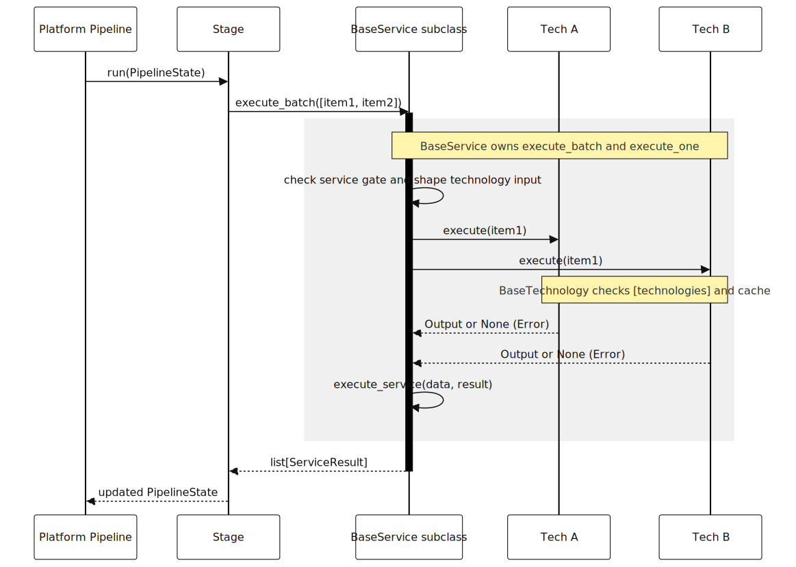

[Back to docs index](README.md)

# Adding A Service

A service coordinates one reusable task across one or more technology adapters. Platform stages call services; services call technologies; technologies do the concrete work.



## Contract

Services inherit from `BaseService[TInput, TOutput]` in `social_research_probe/services/__init__.py`.

Every service subclass must:

1. Set `service_name`.
2. Set `enabled_config_key` when it should be feature-gated.
3. Implement `_get_technologies()`.
4. Implement `execute_service(data, result)`.

Do not override `execute_batch()` or `execute_one()`. `BaseService.__init_subclass__()` rejects subclasses that override those lifecycle methods.

## Lifecycle

```text
platform stage
  -> service.execute_batch(inputs)
  -> BaseService.execute_one(input)
  -> technology.execute(technology_input)
  -> TechResult list
  -> service.execute_service(data, result)
  -> ServiceResult
```

`execute_service()` is where the service converts technology outputs into the shape the next pipeline stage expects.

## Minimal Example

```python
from __future__ import annotations

from typing import ClassVar

from social_research_probe.services import BaseService, ServiceResult
from social_research_probe.technologies.example.sentiment import SentimentTech


class SentimentService(BaseService[dict, dict]):
    service_name: ClassVar[str] = "youtube.enriching.sentiment"
    enabled_config_key: ClassVar[str] = "services.youtube.enriching.sentiment"

    def _get_technologies(self) -> list[object]:
        return [SentimentTech()]

    async def execute_service(self, data: dict, result: ServiceResult) -> ServiceResult:
        sentiment = next(
            (tr.output for tr in result.tech_results if tr.success and isinstance(tr.output, dict)),
            {},
        )
        if result.tech_results:
            result.tech_results[0].output = {**data, "sentiment": sentiment}
            result.tech_results[0].success = bool(sentiment)
        return result
```

The service does not call an API directly. The concrete provider lives in `SentimentTech`.

## Connecting A Stage

```python
from social_research_probe.platforms import BaseStage
from social_research_probe.platforms.state import PipelineState
from social_research_probe.services.enriching.sentiment import SentimentService


class YouTubeSentimentStage(BaseStage):
    @property
    def stage_name(self) -> str:
        return "sentiment"

    async def execute(self, state: PipelineState) -> PipelineState:
        top_n = list(state.get_stage_output("summary").get("top_n", []))
        if not self._is_enabled(state) or not top_n:
            state.set_stage_output("sentiment", {"top_n": top_n})
            return state

        inputs = [item for item in top_n if isinstance(item, dict)]
        results = await SentimentService().execute_batch(inputs)
        enriched = [
            tr.output
            for result in results
            for tr in result.tech_results
            if tr.success and isinstance(tr.output, dict)
        ]
        state.set_stage_output("sentiment", {"top_n": enriched})
        return state
```

Add the stage to `YouTubePipeline.stages()` only after deciding where it belongs in the evidence order.

## Config

Add defaults in `DEFAULT_CONFIG` and `config.toml.example`:

```toml
[stages.youtube]
sentiment = true

[services.youtube.enriching]
sentiment = true

[technologies]
sentiment_provider = true
```

The service gate name should be discoverable by `Config.service_enabled()`. Current service gates are nested under `[services.youtube.*]` with simple boolean leaves.

## Tests

Add focused tests for:

| Test | What it proves |
| --- | --- |
| Service unit test | `execute_service()` handles success, failure, and empty technology output. |
| Stage unit test | Stage reads the right prior output and writes a stable output key. |
| Config test | Stage/service/technology gates disable the new behavior correctly. |
| Integration test | Pipeline still assembles a report when the service succeeds or is disabled. |

## Rules

- Keep API keys, subprocess calls, HTTP calls, and provider response parsing in technologies.
- Keep platform-specific ordering in platform stages.
- Return stable dictionaries from stages; downstream stages should not parse raw `ServiceResult` unless that stage owns the boundary.
- Preserve partial success. A failed technology should not erase unrelated evidence.
