[Back to docs index](README.md)

# API Costs And Keys

The code has several possible external boundaries. Whether they cost money depends on provider accounts and current provider terms, so the docs describe where calls happen rather than promising prices.

## Secret Names

| Provider | Secret names |
| --- | --- |
| YouTube Data API | `youtube_api_key` |
| Exa | `exa_api_key` |
| Brave | `brave_api_key` |
| Tavily | `tavily_api_key` |

Environment variables are `SRP_YOUTUBE_API_KEY`, `SRP_EXA_API_KEY`, `SRP_BRAVE_API_KEY`, and `SRP_TAVILY_API_KEY`.

## Cost Controls In Code

| Control | Where |
| --- | --- |
| `platforms.youtube.max_items` | Limits fetched YouTube results. |
| `platforms.youtube.enrich_top_n` | Limits transcript, comments, summaries, claims, corroboration. |
| `corroboration.max_claims_per_item` | Caps claims per item before provider checks. |
| `corroboration.max_claims_per_session` | Caps total checked claims. |
| Stage gates | Skip whole steps. |
| Service and technology gates | Disable provider or renderer categories. |
| Cache | Avoid repeated provider/runner calls for the same technology input. |
| `SRP_FAST_MODE` | Reduces top-N enrichment depth in orchestrator code. |

## Runner Accounts

LLM runner CLIs authenticate outside srp. srp stores runner selection and extra flags in config, but it does not store Claude, Gemini, or Codex account tokens.

## Recommended First Run

Use `demo-report` first. Then run live YouTube with summaries and corroboration disabled if you want a low-cost smoke test. Enable LLM and corroboration providers only after confirming the fetch and score path works.
