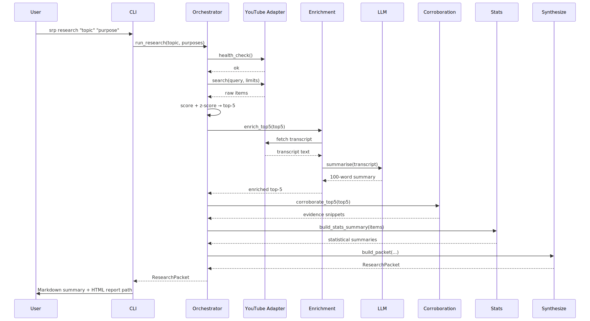

# Architecture

[Home](README.md) → Architecture

`srp` is a Python CLI that delegates to a five-stage research pipeline. This document describes the module layout, data flow, and extension points.

---

## System Diagram


---

## Component Map



## Layered Module Map

| Package | Responsibility |
|---|---|
| `cli/` | Argument parsing, subcommand dispatch, synthesis attachment. Zero pipeline logic. |
| `commands/` | Parsed command value objects (`ParsedRunResearch`) built from raw argparse namespaces. |
| `pipeline/` | Orchestration: adapter setup → search → enrich → score → corroborate → synthesize. |
| `platforms/` | Platform adapter interface (`PlatformAdapter`) + YouTube implementation. |
| `corroboration/` | Exa, Brave, and Tavily web-search backends plus `host` auto-discovery mode. |
| `llm/` | Multi-LLM ensemble — Claude, Gemini, and Codex fan-out with first-success fallback. |
| `stats/` | 15+ statistical models (regression, Bayesian linear, bootstrap, k-means, PCA, Kaplan–Meier, …). |
| `viz/` | PNG chart rendering via matplotlib. |
| `synthesize/` | Evidence summaries, packet builder, warning detection, Markdown + HTML formatter. |
| `scoring/` | Composite trust / trend / opportunity score formulas. |
| `purposes/` | Purpose registry, merge semantics, pending-proposal workflow. |
| `state/` | Persistent on-disk state for topics, purposes, and proposals. |
| `config.py` | `Config` dataclass loaded from TOML; single source of truth for all settings. |

---

## Pipeline Walkthrough

The core pipeline runs inside `pipeline/orchestrator.py::run_research`.



### Stages

1. **Adapter setup** — resolve the platform adapter from the registry; run `health_check()`.
2. **Per-topic loop** — for each `(topic, purpose)` pair:
   - Enrich the query using topic keywords and purpose metadata.
   - Search the platform adapter (`adapter.search(query, limits)`).
   - Enrich each result: fetch transcripts (YouTube captions → Whisper fallback), generate a 100-word LLM summary.
   - Compute signals: view velocity, channel credibility, cross-channel repetition.
   - Score and z-score each item; extract the top-5.
3. **Corroboration** — for each top-5 item, query one or more corroboration backends (Exa / Brave / Tavily) concurrently; attach evidence snippets.
4. **Statistics** — run `_build_stats_summary` over all scored items: 15+ models including regression, Bayesian, bootstrap, clustering, and survival analysis.
5. **Charts** — render PNGs for score distribution, trend lines, cluster maps, etc.
6. **Packet assembly** — `synthesize/formatter.build_packet` assembles a `ResearchPacket`; multi-topic runs produce a `MultiResearchPacket`.

---

## Data Flow



```
topics + purposes
       │
       ▼
  Platform search  ──► raw items (title, channel, views, url)
       │
       ▼
  Transcript enrichment  ──► LLM summary (100 words)
       │
       ▼
  Scoring + z-score  ──► ranked list, top-5
       │
       ▼
  Corroboration  ──► evidence snippets per top-5 item
       │
       ▼
  Stats + charts  ──► statistical summaries, PNG files
       │
       ▼
  build_packet  ──► ResearchPacket (JSON-serialisable)
       │
       ▼
  HTML + Markdown report
```

---

## Async Model



The pipeline uses `asyncio` for concurrency:

- The outer topic loop runs tasks concurrently up to a configurable semaphore limit.
- Transcript enrichment, LLM ensemble calls, and corroboration backend queries all use `asyncio.gather` for fan-out.
- Platform adapters that are still synchronous are wrapped with `asyncio.to_thread`.
- `cli.main` is an async entry point wrapped by a top-level `asyncio.run`.

---

## Extension Points

### Add a platform adapter

1. Implement `PlatformAdapter` from `platforms/base.py` (search, enrich, health_check).
2. Register it in `platforms/registry.py`.
3. Add a fake for tests; register via `SRP_TEST_USE_FAKE_<NAME>=1`.

### Add a corroboration backend

1. Implement `CorroborationBackend` from `corroboration/base.py` (corroborate, health_check).
2. Register it in `corroboration/registry.py`.
3. Backend is auto-discovered when `corroboration.backend = host` and `health_check()` passes.

### Add a stats model

1. Add a function in the relevant `stats/` module.
2. Register it in `_stats_models_for` in `pipeline/stats.py`.
3. Update `docs/MODEL_APPLICABILITY.md`.

### Add an LLM runner

1. Implement `LLMRunner` from `llm/base.py`.
2. Register it in `llm/registry.py`.
3. Add a unit test asserting the runner prompt contract.

---

## Configuration and Data Directory

`Config.load(data_dir)` reads `<data_dir>/config.toml`. The data directory defaults to `~/.social-research-probe` and can be overridden with `$SRP_DATA_DIR`.

The directory layout:

```
~/.social-research-probe/
├── config.toml          # all settings (llm.runner, corroboration.backend, …)
├── topics.json          # registered topics
├── purposes.json        # registered purposes
├── pending.json         # proposals awaiting apply/discard
├── charts/              # rendered PNG charts
└── reports/             # generated HTML reports
```

---

## Release Pipeline


When a `VERSION` file change is pushed to `main`, the `release.yml` workflow creates a git tag, builds the distribution, computes SHA-256 checksums, creates a GitHub release, and publishes to PyPI via OIDC trusted-publishing.

## See also

- [Design Patterns](design-patterns.md) — patterns that shape the module structure
- [Testing](testing.md) — how the pipeline is exercised in tests
- [Security](security.md) — trust boundaries and secret handling
