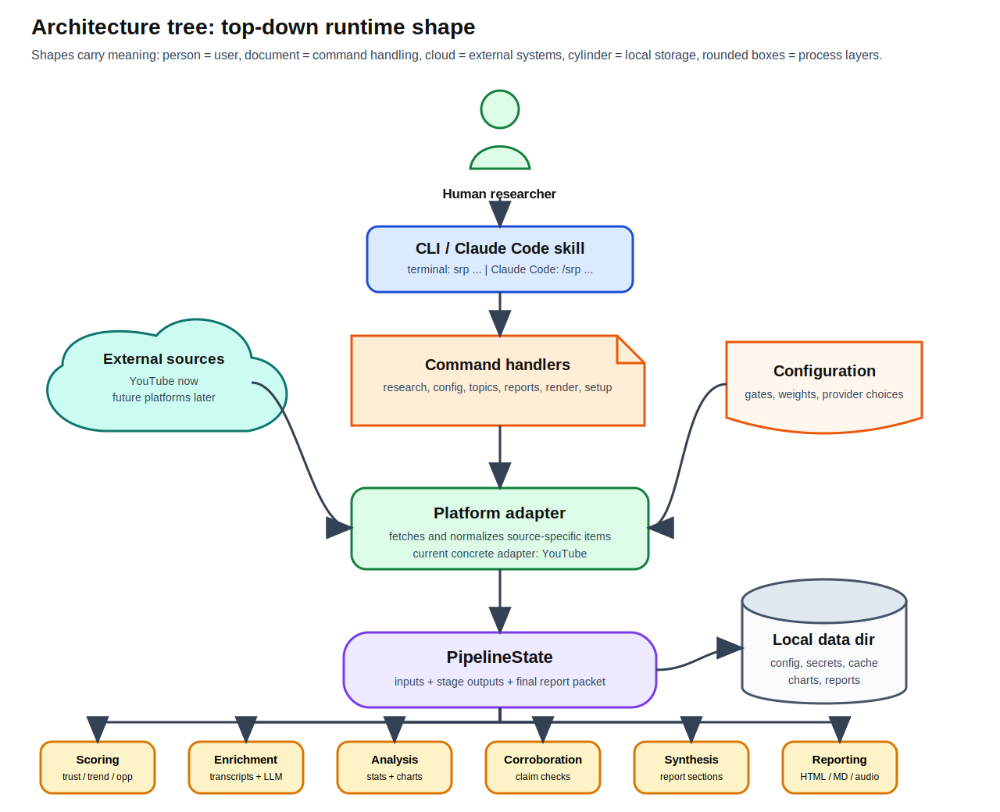

[Back to docs index](README.md)

# Architecture

Social Research Probe is a staged CLI application. Its main design rule is that source-specific logic, reusable orchestration, concrete providers, and support utilities live in different layers.



## Requirements

| Requirement | Current implementation |
| --- | --- |
| Run research from a terminal or bundled skill | `srp` console script, `cli/parsers.py`, `cli/handlers.py`, and `commands/*`. |
| Fetch public platform evidence | YouTube pipeline and YouTube media-fetch technologies. |
| Keep runs auditable | `PipelineState` stage outputs, reports, export package, cache, and optional SQLite persistence. |
| Rank sources before expensive work | Scoring stage computes trust, trend, opportunity, and overall score before enrichment. |
| Support optional generated text | LLM runner adapters for Claude, Gemini, Codex, and local wrappers. |
| Check claims when providers are configured | Claim extraction plus Exa, Brave, Tavily, and LLM-search corroboration providers. |
| Produce human and machine outputs | HTML/Markdown reports, chart PNGs, CSV exports, methodology Markdown, run-summary JSON, SQLite. |

## Layers


| Layer | Package | Responsibility |
| --- | --- | --- |
| CLI | `social_research_probe/cli` | Build `argparse` parsers and dispatch parsed namespaces. |
| Commands | `social_research_probe/commands` | Implement user-facing operations such as research, config, topics, reports, database, and claims. |
| Config | `social_research_probe/config.py` | Resolve the data directory, merge defaults with `config.toml`, and answer stage/service/technology gates. |
| Platforms | `social_research_probe/platforms` | Own platform contracts, pipeline stage order, and platform-specific stages. |
| Services | `social_research_probe/services` | Coordinate one task and normalize `ServiceResult`/`TechResult` output. |
| Technologies | `social_research_probe/technologies` | Perform one concrete provider call, renderer action, persistence write, or pure algorithm. |
| Utils | `social_research_probe/utils` | Shared state, cache, types, parsing, display, reports, claims, narratives, and IO helpers. |


The intended dependency direction is downward: commands call platforms, platforms call services, services call technologies, and technologies use utilities. A technology should not parse CLI args. A command should not know the details of a provider response.

## Runtime State

The central runtime object is `PipelineState` from `platforms/state.py`.

| Field | Meaning |
| --- | --- |
| `platform_type` | Current platform key, such as `youtube` or `all`. |
| `cmd` | Parsed command object. |
| `platform_config` | Merged platform defaults plus CLI overrides such as `--no-html`. |
| `inputs` | Topic, selected purpose names, and merged purpose definition. |
| `outputs` | Stage outputs, service outputs, and final `report`. |


Stages communicate by named outputs, not by long positional argument chains. That makes the pipeline easy to inspect and test, but it also means stage keys and payload shapes are contracts.

## Platform, Service, Technology


| Concept | Owns | Does not own |
| --- | --- | --- |
| Platform stage | Stage order, source-specific inputs, and where to store outputs. | Provider API details that can live in a technology. |
| Service | Batch execution, technology selection, result normalization, and partial failure handling. | CLI parsing or platform-specific command grammar. |
| Technology | One concrete operation: API call, CLI invocation, chart render, SQL persist, or pure algorithm. | Pipeline order or final report composition. |

`BaseService` owns `execute_batch()` and `execute_one()`. Subclasses implement `_get_technologies()` and `execute_service()`. `BaseTechnology` owns flag checks, cache behavior, timing, and error isolation. Subclasses implement `_execute()`.

## Current YouTube Pipeline

The YouTube pipeline stages are grouped like this:

```text
fetch
classify
score
transcript + stats + charts
comments
summary
claims
corroborate
narratives
synthesis
assemble
structured_synthesis
report + narration
export
persist
```

The only intentionally parallel stage groups are `transcript + stats + charts` and `report + narration`.

## Tradeoffs


| Choice | Benefit | Cost |
| --- | --- | --- |
| Local-first data directory | Easy to inspect, copy, delete, and isolate per project. | Users must understand where config, secrets, cache, and reports live. |
| CLI runner adapters instead of model SDKs | Users authenticate with existing Claude/Gemini/Codex CLIs. | Adapters must handle subprocess output shape and timeouts. |
| Top-N enrichment | Controls cost and runtime. | A useful item outside top-N may not receive transcript, summary, claims, or corroboration. |
| Service/technology split | Keeps provider code replaceable and testable. | More small files than a single script. |
| SQLite persistence as optional final stage | Enables history and claim review without making the whole pipeline database-first. | Database schema must be migrated carefully. |

## Placement Rules

| Change | Likely home |
| --- | --- |
| New CLI command or flag | `cli/parsers.py`, `cli/handlers.py`, `commands/*`. |
| New source or source-specific stage order | `platforms/<name>/`. |
| New reusable task in a pipeline | `services/<domain>/` plus a platform stage. |
| New provider, renderer, algorithm, or persistence adapter | `technologies/<domain>/`. |
| New cross-cutting helper | `utils/<domain>/`, only if it is not product behavior. |
| New output in the research packet | Stage implementation, report formatter/renderer/exporter, persistence if needed, and tests. |

Before adding an abstraction, check whether the repository already has the boundary you need. Most extension work should fit the existing platform, service, technology, registry, and result-object patterns.
