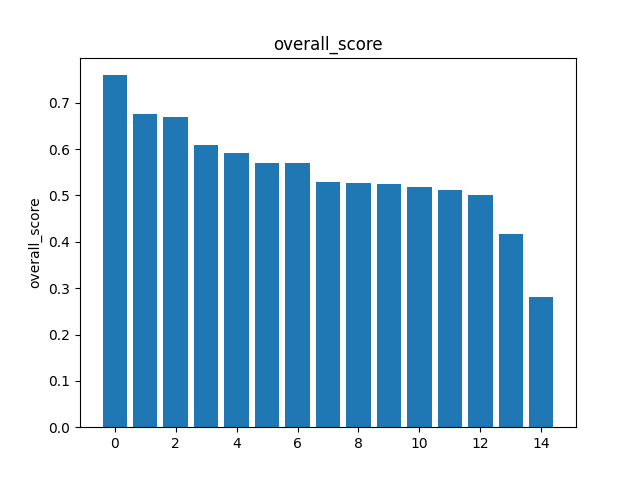
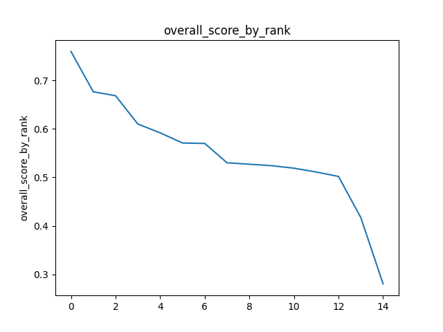
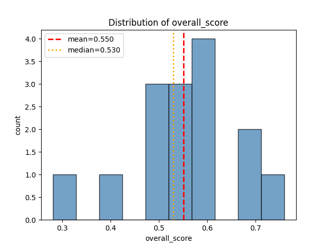
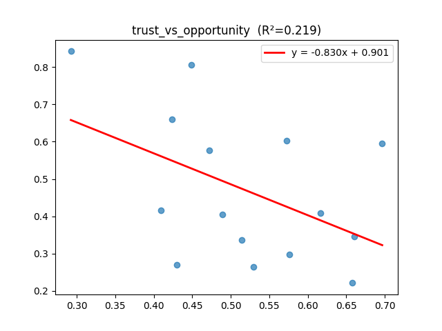
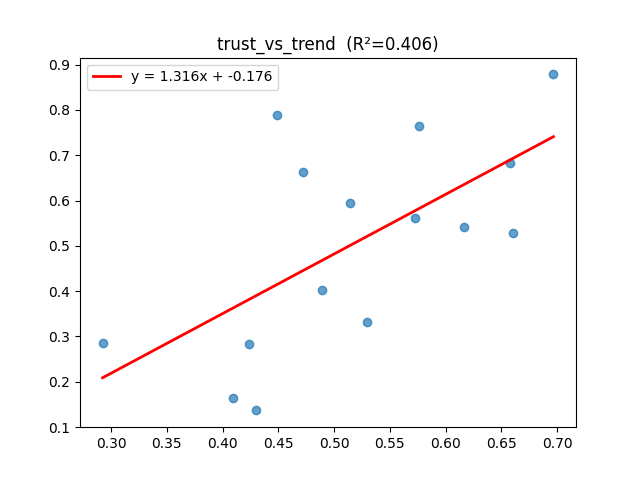
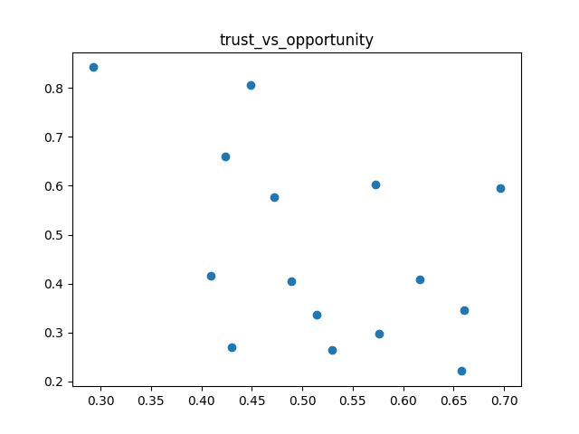
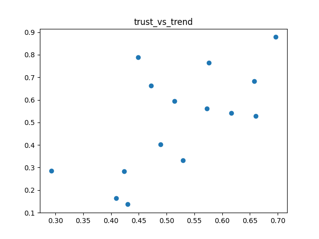
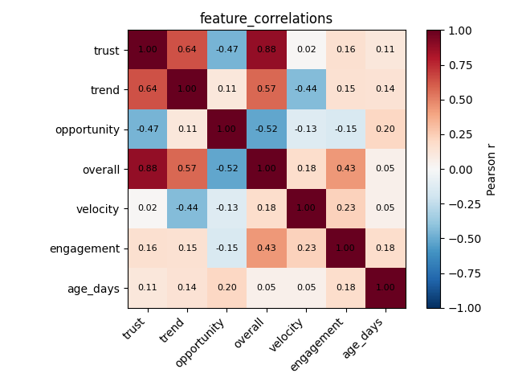
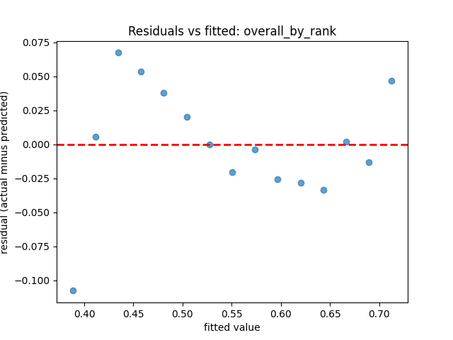
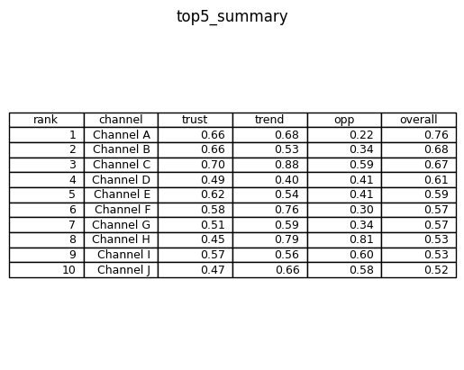

[Back to docs index](README.md)

# Charts

Charts turn the scored platform result set into visual checks. They are generated by `ChartsService`, composed in `services/analyzing/charts_suite.py`, and saved as PNG files under `data_dir/charts`.

The chart input is `scored_items`: each item has `overall_score`, `trust`, `trend`, `opportunity`, and derived features such as `view_velocity`, `engagement_ratio`, and `age_days`.

Use charts to answer questions that are hard to see in tables: whether scores drop smoothly, whether one item is an outlier, whether trust and opportunity move together, and whether engagement features tell a different story from the final ranking.

Every chart should be read with the same caution as the statistics page: it describes the current fetched dataset, not the entire platform. A chart can show that one result set is skewed or clustered, but it cannot prove the platform as a whole behaves that way.

## Chart suite

| Chart | File pattern | What it shows |
| --- | --- | --- |
| Overall score bar | `overall_score_bar.png` | One bar per ranked item. Taller bars mean stronger combined trust/trend/opportunity score. |
| Overall by rank line | `overall_score_by_rank_line.png` | Overall score by rank order. A steep drop means the top few items are much stronger than the rest. |
| Overall score histogram | `overall_score_histogram.png` | Distribution of overall scores with mean and median markers. |
| Trust vs opportunity regression | `trust_vs_opportunity_regression.png` | Whether higher trust tends to align with higher opportunity. Includes fitted line and R squared. |
| Trust vs trend regression | `trust_vs_trend_regression.png` | Whether higher trust tends to align with stronger trend signals. Includes fitted line and R squared. |
| Trust vs opportunity scatter | `trust_vs_opportunity_scatter.png` | Individual item positions across trust and opportunity without forcing a trend line. |
| Trust vs trend scatter | `trust_vs_trend_scatter.png` | Individual item positions across trust and trend without forcing a trend line. |
| Feature correlation heatmap | `feature_correlations.png` | Pairwise Pearson correlations across score and engagement features. |
| Overall by rank residuals | `overall_by_rank_residuals.png` | Difference between actual overall score and the linear rank model. |
| Top 10 summary table | `top_n_summary_table.png` | Compact score table with rank, channel, trust, trend, opportunity, and overall score. |

## How to interpret each chart

### Overall score bar

Use this first. It shows whether the ranked list has one obvious leader, a tight cluster, or a long tail. Similar bar heights mean the ordering is less decisive; a large first bar means the top item is clearly stronger by the scoring formula.

### Overall by rank line

This is the same score series as the bar chart, but it emphasizes slope. A smooth decline means the ranking is stable. A cliff after rank 1 or 2 means only a few items carry most of the signal. A flat line means the query returned many similarly scored items.

### Overall score histogram

The histogram shows the score distribution. Mean and median close together usually mean a balanced result set. Mean above median suggests a few high-scoring items are pulling the average up. Median above mean suggests a few weak items are pulling the average down.

### Trust vs opportunity regression

This chart asks whether credible sources also look like good opportunities. A positive slope means trust and opportunity rise together. A negative slope means more trusted items may already be saturated or less novel. A low R squared means the fitted line is weak and individual points matter more than the trend.

### Trust vs trend regression

This chart asks whether credible sources also have momentum. A positive slope is useful when you want credible topics that are also moving. A flat or weak line means trend is coming from factors other than trust, such as recency or engagement spikes.

### Scatter plots

Scatter plots show individual items without implying that a straight-line model is correct. Look for clusters and outliers:

- high trust and high opportunity: strong candidates for deeper review.
- high trust and low opportunity: credible but possibly already covered or less novel.
- low trust and high trend/opportunity: interesting but needs corroboration.
- isolated points: inspect manually before drawing conclusions.

### Feature correlation heatmap

The heatmap compares `trust`, `trend`, `opportunity`, `overall`, `velocity`, `engagement`, and `age_days`. Values near `1.00` move together. Values near `-1.00` move in opposite directions. Values near `0.00` show little linear relationship.

Do not treat correlation as causation. The heatmap is a quick way to spot relationships worth reading, not proof that one metric causes another.

### Overall by rank residuals

Residuals show how far each item is from a simple linear rank trend. Points near zero fit the rank pattern. Large positive residuals are stronger than the simple trend predicts. Large negative residuals are weaker than expected for their rank area. Curved or funnel-shaped residuals mean the rank-to-score relationship is not well described by a straight line.

### Top 10 summary table

Use the table when you need exact score values instead of shapes. It is also useful for checking whether the visual charts match the top-ranked channels and score components.

## Reading rules

- Compare charts together. A high overall score should be explainable by trust, trend, or opportunity.
- Treat small datasets cautiously. With only a few items, scatter and regression charts are visual hints, not stable statistics.
- Inspect outliers manually. Charts point to candidates for review; they do not replace source reading.
- Use corroboration for claims. Charts describe score structure, not factual truth.

If one chart renderer fails, the chart suite keeps the remaining charts. That keeps visual analysis available even when one renderer or data shape is not usable.

## Common chart mistakes

| Mistake | Better reading |
| --- | --- |
| Treating a high score bar as proof the source is true. | Use it as a ranking signal, then check transcript and corroboration. |
| Treating correlation as causation. | Use correlation to find relationships worth inspecting. |
| Ignoring sample size. | A chart from five items is a rough guide, not a strong distribution estimate. |
| Comparing charts across runs with different config. | First confirm the same topic, purpose, platform, `max_items`, and cache freshness. |
