[Back to docs index](README.md)

# Charts

`ChartsTech` renders chart PNGs into `<data_dir>/charts`. The chart suite reads scored item dictionaries and builds views over `scores` and `features`.

## Rendered Suite

`render_all()` attempts these renderers and skips any renderer that raises:

| Chart | Source data |
| --- | --- |
| Overall score bar | `scores.overall` |
| Overall by rank line | `scores.overall` by sorted rank |
| Overall score histogram | `scores.overall` |
| Trust vs opportunity regression scatter | `scores.trust`, `scores.opportunity` |
| Trust vs trend regression scatter | `scores.trust`, `scores.trend` |
| Trust vs opportunity scatter | `scores.trust`, `scores.opportunity` |
| Trust vs trend scatter | `scores.trust`, `scores.trend` |
| Feature correlation heatmap | trust, trend, opportunity, overall, velocity, engagement, age |
| Overall by rank residuals | rank and `scores.overall` |
| Top 10 summary table | rank, channel, trust, trend, opportunity, overall |

The chart selector used by standalone chart rendering chooses a bar chart for one to five points and a line chart for six or more.
