[Back to docs index](README.md)

# Source Classification



Source classification assigns a `source_class` label to each fetched item. The label describes the channel's relationship to the topic being researched.

## Classes

| Label | Meaning |
| --- | --- |
| `primary` | The channel is the original creator or subject matter owner. |
| `secondary` | The channel redistributes, curates, or aggregates primary content. |
| `commentary` | The channel offers opinion, review, or analysis on the topic. |
| `unknown` | The system could not determine the class with confidence. |

## Three-tier architecture

Classification uses a layered approach to balance speed, cost, and accuracy.

### 1. Curated channel map

A hardcoded lookup table (`_CURATED_CHANNEL_MAP`) maps known channel name fragments to their class. This is the fastest path — a simple substring match with zero API cost. Channels like major news outlets or well-known creators are resolved here.

### 2. Heuristic classifier (`HeuristicClassifier`)

When the curated map has no match, two regex layers fire in sequence:

1. **Channel name signal** (`classify_by_channel_name_signal`) — checks the channel name for keywords. Names containing "news", "official", or "records" map to `primary`; "clips", "highlights", or "archive" to `secondary`; "podcast", "react", or "show" to `commentary`.
2. **Title signal** (`classify_by_title_signal`) — if the channel name yields `unknown`, the video title is checked for commentary patterns like "react", "review", or "breakdown". This only promotes to `commentary`, never to `primary` or `secondary`.

### 3. LLM classifier (`LLMClassifier`)

When heuristics return `unknown`, the system falls back to the configured LLM runner. It sends the channel name and sample video title to the runner with a structured JSON schema requesting a `source_class` value. The runner response is coerced to a valid class or falls back to `unknown`.

The Claude runner extracts the model response from the CLI's JSON envelope (`structured_output` field), so the classifier receives the actual model output rather than the raw envelope.

### Hybrid classifier (`HybridClassifier`)

The default classifier. It runs the heuristic classifier first, then falls back to the LLM classifier only when the heuristic returns `unknown`. This minimises API cost while maintaining accuracy.

## Configuration

The classifier provider is set per-platform in the services config:

```toml
[services.youtube.classifying]
provider = "hybrid"  # hybrid | heuristic | llm
```

The technology gate controls whether classification runs at all:

```toml
[technologies]
classifying = true
```

When classification is disabled or all classifiers fail, items receive the `unknown` label and the pipeline continues.

## Pipeline integration

`YouTubeClassifyStage` runs after fetch and before scoring. It calls `SourceClassService`, which selects the configured classifier and applies it to each item. The resulting `source_class` label is stored on each item and used by downstream stages for filtering and weighting.

## Extending

To add a new classifier, create a class extending `BaseTechnology[dict, SourceClass]` in `social_research_probe/technologies/classifying/`, set `name` and `enabled_config_key`, implement `_execute()`, and register the new provider name in `SourceClassService`.
