[Back to docs index](README.md)

# Commands



`srp` is the command-line entry point. Every command follows this shape:

```bash
srp [GLOBAL_FLAGS] COMMAND [COMMAND_FLAGS] [ARGUMENTS]
```

Use `srp --help` or `srp COMMAND --help` when you need the parser's exact flag list.

## Terminal vs Claude Code skill

The Claude Code skill uses the same command surface with a different prefix.
Everything after `/srp` is the same argument list you would pass after `srp` in
a terminal.

| Task | Terminal CLI | Claude Code skill |
| --- | --- | --- |
| Run research | `srp research "AI safety" "latest-news"` | `/srp research "AI safety" "latest-news"` |
| Show config | `srp config show` | `/srp config show` |
| Show topics as JSON | `srp show-topics --output json` | `/srp show-topics --output json` |
| Use a data directory | `srp --data-dir ./.skill-data config path` | `/srp --data-dir ./.skill-data config path` |

The skill does not define a separate language. It tells Claude Code to operate
the local `srp` CLI, surface stdout on success, and show stderr plus exit code
on failure. The CLI remains the source of truth.

For workflow examples and how to decide which command to use, see
[Usage](usage.md).

## Global flags

| Flag | How to use it | Example |
| --- | --- | --- |
| `--data-dir PATH` | Put config, secrets, state, cache, charts, and reports under a specific directory. | `srp --data-dir ./.skill-data config path` |
| `--verbose` | Print more runtime detail. | `srp --verbose research "AI agents" "latest-news"` |
| `--version` | Print the installed package version and path. | `srp --version` |

Example output for `--data-dir` with `config path`:

```text
config: /absolute/path/.skill-data/config.toml
secrets: /absolute/path/.skill-data/secrets.toml
```

## Output formats

State and config commands usually accept `--output text`, `--output json`, or `--output markdown`.

```bash
srp show-topics --output text
srp show-topics --output json
srp show-topics --output markdown
```

Representative outputs:

```text
AI safety
model collapse
```

```json
{"topics":["AI safety","model collapse"]}
```

````markdown
```
AI safety
model collapse
```
````

## Research

Run the full research pipeline.

```bash
srp research [platform] TOPIC PURPOSES [--no-shorts] [--no-transcripts] [--no-html]
```

`platform` is optional. If it is omitted, the parser targets all registered platforms. In the current codebase, the implemented concrete platform is YouTube.

`PURPOSES` is a comma-separated list of saved purpose names.

Example input:

```bash
srp research youtube "AI agents" "latest-news,trends" --no-shorts
```

Expected output shape:

```text
srp serve-report --report /Users/example/.social-research-probe/reports/ai_agents.html
```

If HTML is disabled or cannot be written, the output is a Markdown report path:

```text
/Users/example/.social-research-probe/report.md
```

Use `--no-transcripts` when you only want scoring, statistics, charts, and report structure without transcript fetching. Use `--no-html` when you do not want the HTML file written.

## Topics

Topics are saved strings used to organize repeat research.

### Show topics

```bash
srp show-topics
```

Example output:

```text
AI safety
model collapse
```

If none exist:

```text
(no topics)
```

### Add topics

```bash
srp update-topics --add "AI safety" "model collapse"
```

Expected output:

```json
{
  "ok": true
}
```

Near-duplicate topics are rejected unless you pass `--force`.

### Remove topics

```bash
srp update-topics --remove "model collapse"
```

Expected output:

```json
{
  "ok": true
}
```

### Rename a topic

```bash
srp update-topics --rename "AI safety" "AI governance"
```

Expected output:

```json
{
  "ok": true
}
```

## Purposes

A purpose tells the pipeline how to frame the research question and can influence scoring.

### Show purposes

```bash
srp show-purposes
```

Example output:

```text
latest-news: Find recent reporting and claims
trends: Find rising topics and momentum signals
```

If none exist:

```text
(no purposes)
```

### Add a purpose

```bash
srp update-purposes --add 'latest-news=Find recent reporting and claims'
```

Expected output:

```json
{
  "ok": true
}
```

The input format is `name=method`. The name is what you pass to `srp research`; the method is the plain-language instruction used by the pipeline.

### Remove purposes

```bash
srp update-purposes --remove latest-news trends
```

Expected output:

```json
{
  "ok": true
}
```

### Rename a purpose

```bash
srp update-purposes --rename latest-news recent-claims
```

Expected output:

```json
{
  "ok": true
}
```

## Suggestions

Suggestion commands create pending topic or purpose candidates. They do not change active topics or purposes until you apply them.

### Suggest topics

```bash
srp suggest-topics --count 3
```

Expected output shape:

```json
{
  "staged_topic_suggestions": [
    {
      "value": "on-device LLMs",
      "reason": "seed pool (no LLM runner configured)"
    }
  ]
}
```

If an LLM runner is configured, suggestions come from that runner. If no runner is configured, `suggest-topics` uses a deterministic seed pool.

### Suggest purposes

```bash
srp suggest-purposes --count 2
```

Expected output shape:

```json
{
  "staged_purpose_suggestions": [
    {
      "name": "market-map",
      "method": "Map active channels, claims, and opportunity signals"
    }
  ]
}
```

This command requires an LLM runner. If `llm.runner` resolves to `none`, it exits with a validation error.

### Stage suggestions from stdin

```bash
printf '%s\n' '{
  "topic_candidates": [{"value": "AI hardware", "reason": "important infrastructure topic"}],
  "purpose_candidates": [{"name": "claims", "method": "Track repeated claims and evidence"}]
}' | srp stage-suggestions --from-stdin
```

Expected output:

```json
{
  "ok": true
}
```

### Show pending suggestions

```bash
srp show-pending --output json
```

Expected output shape:

```json
{
  "schema_version": 1,
  "pending_topic_suggestions": [
    {
      "id": 1,
      "value": "AI hardware",
      "reason": "important infrastructure topic",
      "duplicate_status": "new",
      "matches": []
    }
  ],
  "pending_purpose_suggestions": []
}
```

### Apply or discard pending suggestions

Apply all pending topic suggestions:

```bash
srp apply-pending --topics all
```

Apply selected pending purpose IDs:

```bash
srp apply-pending --purposes 1,3
```

Discard selected pending topic IDs:

```bash
srp discard-pending --topics 2,4
```

Expected output for apply/discard:

```json
{
  "ok": true
}
```

## Configuration

Config commands read and write the active data directory.

### Show merged config

```bash
srp config show
```

Expected output shape:

```text
data_dir: /Users/example/.social-research-probe
config_file: /Users/example/.social-research-probe/config.toml
secrets_file: /Users/example/.social-research-probe/secrets.toml

[config]
{
  "llm": {
    "runner": "none",
    "timeout_seconds": 60
  }
}

[secrets]
  youtube_api_key: abcd...wxyz  (from file)
```

### Show paths

```bash
srp config path
```

Expected output shape:

```text
config: /Users/example/.social-research-probe/config.toml
secrets: /Users/example/.social-research-probe/secrets.toml
```

### Set a config value

```bash
srp config set llm.runner gemini
srp config set platforms.youtube.enrich_top_n 3
srp config set technologies.tavily false
```

Expected output:

```text
(no stdout on success)
```

Values are parsed as booleans, integers, floats, or strings. Keys are dotted TOML paths.

### Set or remove a secret

```bash
srp config set-secret youtube_api_key
```

The command prompts for the value unless `--from-stdin` is used:

```bash
printf '%s' "$YOUTUBE_API_KEY" | srp config set-secret youtube_api_key --from-stdin
```

Expected output:

```text
(no stdout on success)
```

Remove a secret:

```bash
srp config unset-secret youtube_api_key
```

Expected output:

```text
(no stdout on success)
```

### Check secrets

```bash
srp config check-secrets --needed-for research --platform youtube --corroboration brave
```

Expected output shape:

```json
{
  "required": ["youtube_api_key", "brave_api_key"],
  "optional": ["exa_api_key", "tavily_api_key"],
  "present": ["youtube_api_key"],
  "missing": ["brave_api_key"]
}
```

## Corroborate claims

Use this when you already have claims in a JSON file and want provider evidence without running a full research pipeline.

Input file:

```json
{
  "claims": [
    {
      "text": "Example claim to check",
      "source_text": "Longer paragraph where the claim appeared"
    }
  ]
}
```

Command:

```bash
srp corroborate-claims --input claims.json --providers brave,exa --output evidence.json
```

Expected output file shape:

```json
{
  "results": [
    {
      "claim_text": "Example claim to check",
      "results": [],
      "aggregate_verdict": "inconclusive",
      "aggregate_confidence": 0.0
    }
  ]
}
```

Exact fields inside each result depend on the provider implementation and available evidence.

## Watch topics and alerts

Use `watch` for local-first monitoring. Watch definitions, watch run history, and alert events are stored in the local SQLite database under the active data directory.

Create a watch:

```bash
srp watch add --topic "AI coding agents" --platform youtube --purpose latest-news
```

List watches:

```bash
srp watch list
srp watch list --output json
```

Run one watch or all enabled watches:

```bash
srp watch run
srp watch run WATCH_ID
srp watch run --notify
srp watch run WATCH_ID --notify --channel file
```

Each watch run executes the normal research pipeline, requires SQLite persistence, compares the new run to the previous matching run when one exists, evaluates deterministic alert rules, and records the result locally. One failed watch does not stop other watches in the same command. Notifications are sent only when `--notify` is passed.

Run watches that are due based on their configured interval:

```bash
srp watch run-due
srp watch run-due --notify
```

Supported intervals are `hourly`, `daily`, and `weekly`. A watch with no interval is manual-only and is skipped by `run-due`. A watch that has never run is due immediately. Unsupported intervals are skipped with a clear message rather than failing the whole command.

List alerts:

```bash
srp watch alerts
srp watch alerts --watch-id WATCH_ID --output markdown
```

Add a custom alert rule:

```bash
srp watch add \
  --topic "AI coding agents" \
  --platform youtube \
  --purpose latest-news \
  --alert-rule '{"metric":"new_claims_count","op":">=","value":5,"severity":"warning"}'
```

Supported rule metrics include `new_narratives_count`, `new_claims_count`, `new_sources_count`, `claims_needing_review`, `rising_risk_score`, `growing_opportunity_score`, `trend_signal_type`, and `narrative_type`.

Test a notification channel:

```bash
srp notify test --channel console
srp notify test --channel file
srp notify test --channel telegram
```

Notifications are local-first. Console and file channels are local. Telegram is optional, disabled by default, and reads token/chat ID from environment variable names configured in `config.toml`; secrets are not stored in SQLite.

Print local scheduling helpers:

```bash
srp schedule cron
srp schedule launchd
srp schedule launchd --output-path ~/Library/LaunchAgents/local.social-research-probe.watch-run-due.plist
```

Schedule helpers print commands that run `srp watch run-due --notify` with the active `--data-dir`. They do not install cron entries, load launchd jobs, start a daemon, or contact a hosted scheduler.

## Render charts and stats from a saved packet

Use `render` when you have a saved report or packet JSON and want chart/stat output for the top-N overall scores.

```bash
srp render --packet packet.json --output-dir ./charts
```

Expected output shape:

```json
{
  "stats": [
    {
      "name": "mean",
      "value": 0.71,
      "caption": "Mean overall_score: 0.71"
    }
  ],
  "chart": {
    "path": "./charts/overall_score_line.png",
    "caption": "Line chart: overall_score over 6 data points"
  }
}
```

## Re-render an HTML report

Use `report` when you have a saved packet/report JSON and want to render HTML again, optionally replacing generated text sections.

```bash
srp report \
  --packet packet.json \
  --compiled-synthesis compiled.md \
  --opportunity-analysis opportunity.md \
  --final-summary summary.md \
  --out report.html
```

Expected stderr when `--out` is used:

```text
[srp] Serve report: srp serve-report --report report.html
```

If `--out` is omitted, the HTML is written to stdout.

## Serve an HTML report

Use `serve-report` to open a local HTTP server for an existing HTML report. This also proxies Voicebox API calls through the same origin.

```bash
srp serve-report --report report.html --host 127.0.0.1 --port 8000
```

Expected output shape:

```text
[srp] Report server: http://127.0.0.1:8000/
```

The command keeps running until interrupted.

## Install skill

Install the Claude Code skill files.

```bash
srp install-skill
srp install-skill --target ~/.claude/skills/srp
```

Expected output shape:

```text
Skill installed to /Users/example/.claude/skills/srp
```

After installation and a Claude Code restart, use the CLI through `/srp`:

```text
/srp research "AI safety" "latest-news"
/srp config show
```

Everything after `/srp` is the same argument list you would pass after `srp` in
a terminal.

Skill behavior:

| Topic | Behavior |
| --- | --- |
| Install location | Default target is `~/.claude/skills/srp`. |
| Discovery | Restart Claude Code after install or refresh. |
| Command mapping | `/srp research ...` maps to `srp research ...`. |
| Secrets | Use `srp config set-secret`; do not paste API keys into chat. |
| Failures | Nonzero exits should show stderr and the exit code. |
| Source of truth | CLI output and files, not generated guesses. |

Troubleshooting:

| Symptom | What to check |
| --- | --- |
| `/srp` is not recognized. | Run `srp install-skill` again and restart Claude Code. |
| `/srp` says `srp` is not found. | Confirm `srp --version` works in the same environment. |
| Summaries or synthesis are missing. | Check `llm.runner`, runner health, and provider configuration. |
| Research cannot start. | Run `srp config check-secrets --needed-for research --platform youtube --output json`. |

## Setup

Run first-time setup or refresh missing config keys.

```bash
srp setup
```

Expected behavior:

- creates the data directory if needed.
- writes missing config defaults without removing existing values.
- prompts for optional runner and secret configuration.

The command is interactive, so exact output depends on the current local state.
