[Back to docs index](README.md)

# Configuration



Configuration is loaded from `DEFAULT_CONFIG` in `social_research_probe/config.py`, then merged with `config.toml` in the active data directory. Secrets are separate. This split matters because normal configuration can be shown, copied, and committed as examples, while API keys should stay masked and local.

The configuration system is intentionally boring: it is a layered set of TOML values and environment variables. That makes it easy to answer "why did this run behave this way?" by checking the active data directory, the config file, and any environment overrides.

## Data directory resolution

Order:

1. `--data-dir PATH`
2. `SRP_DATA_DIR`
3. local `.skill-data` if that directory exists
4. `~/.social-research-probe`

Use `--data-dir` when you want one command to use a specific workspace. Use `SRP_DATA_DIR` when a shell session, CI job, or scripted workflow should consistently use the same directory. Use `.skill-data` when a project should carry its own local state during development. Use the home directory default for personal long-lived settings.

## Main sections

| Section | Controls |
| --- | --- |
| `[llm]` | Runner name, timeout, and runner-specific CLI settings. |
| `[corroboration]` | Provider selection and claim caps. |
| `[platforms.youtube]` | Search result count, recency, top-N enrichment, cache TTLs. |
| `[scoring.weights]` | Optional trust/trend/opportunity weight overrides. |
| `[stages.youtube]` | Stage-level gates. |
| `[services.youtube.*]` | Service-level gates. |
| `[technologies]` | Provider and adapter gates. |
| `[tunables]` | Summary divergence and summary word limits. |
| `[voicebox]` | Optional narration defaults. |

## Gates

A stage runs only if its stage gate allows it. A service or technology also checks its own gate. This gives three levels of control: pipeline step, service family, and concrete provider.

```bash
srp config set llm.runner gemini
srp config set platforms.youtube.enrich_top_n 3
srp config set technologies.tavily false
```

Think of gates as switches at different heights. A stage gate disables a whole part of the pipeline. A service gate disables one service inside that part. A technology gate disables one concrete provider or implementation. Prefer the narrowest gate that solves the problem: turn off `technologies.tavily` if only Tavily should be skipped, but turn off a service when the entire category should be skipped.

## Secrets

Secrets can come from environment variables such as `SRP_YOUTUBE_API_KEY` or from `secrets.toml`. Environment variables win. The secrets file is written with `0600` permissions.

Use environment variables for CI, temporary shells, and secrets managed by another tool. Use `srp config set-secret` for local development when you want the value stored in the data directory. If a provider is configured but its secret is missing, the provider should be treated as unavailable rather than silently making unauthenticated calls.
