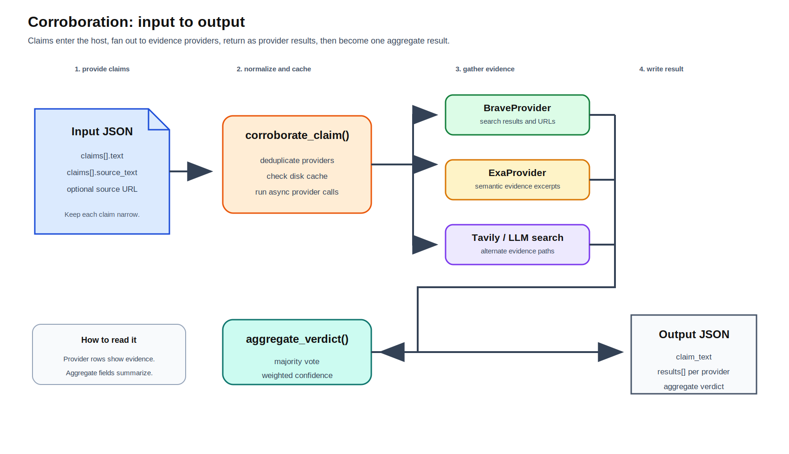
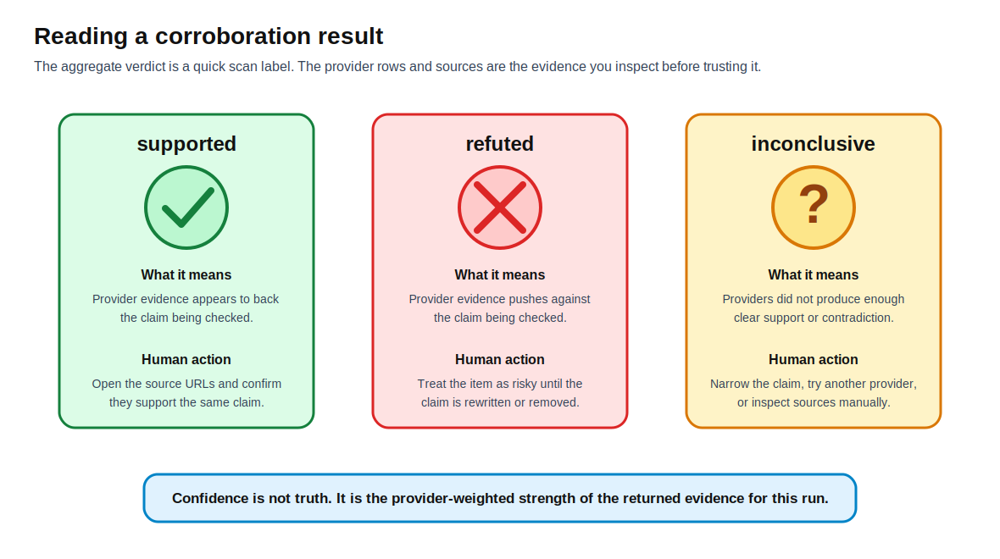

[Back to docs index](README.md)

# Corroboration


Corroboration checks claims from top-ranked items against external evidence. It is optional and controlled by `corroboration.provider`, service gates, technology gates, and available secrets.

The purpose is not to prove every sentence in a report. It is to reduce the risk that a generated summary or source item repeats an unsupported claim. The pipeline extracts or receives claims, sends them to a configured evidence provider, and records the provider response in the report packet so a human can inspect what was checked.



## Providers

| Provider | Secret | Notes |
| --- | --- | --- |
| `exa` | `exa_api_key` | Search API provider. |
| `brave` | `brave_api_key` | Search API provider. |
| `tavily` | `tavily_api_key` | Search API provider. |
| `llm_search` | active runner | Uses a runner's agentic search capability. |
| `none` | none | Disables corroboration. |
| `auto` | provider-specific | Tries enabled healthy providers in configured order. |


## Two ways corroboration runs

Corroboration can run inside the research pipeline or as a standalone command.

| Mode | Input | Output | Use it when |
| --- | --- | --- | --- |
| Research pipeline | Top-ranked research items from the `summary` stage. | Each top-N item may receive a `corroboration` object. | You want claim checks included in the final research report. |
| `corroborate-claims` command | A JSON file containing explicit claims. | A JSON file or stdout payload with `results`. | You already know which claims you want to check. |

Inside the YouTube pipeline, the current implementation uses the item title as the claim text. That keeps corroboration cheap and deterministic, but it is not the same as checking every sentence in a transcript or generated summary. If a title is vague, broad, or clickbait-heavy, the corroboration result will also be vague.

## Standalone input example

Create a file such as `claims.json`:

```json
{
  "claims": [
    {
      "text": "GPT-4 was released in March 2023",
      "source_text": "The speaker said GPT-4 was released in March 2023 during a discussion about model releases."
    },
    {
      "text": "The Earth is flat",
      "source_text": "A source item repeated the claim that the Earth is flat."
    }
  ]
}
```

Field meaning:

| Field | Required | Meaning |
| --- | --- | --- |
| `claims` | yes | List of claims to check. |
| `claims[].text` | yes | The short claim sent to providers. Keep it specific and checkable. |
| `claims[].source_text` | no | Longer surrounding text that explains where the claim came from. If omitted, the command uses `text`. |

Good claim text is narrow:

```text
GPT-4 was released in March 2023
```

Weak claim text is vague:

```text
AI is changing everything
```

The first example has a date and subject. A provider can search for it and return concrete support or contradiction. The second example is too broad; even good providers will likely return weak or mixed evidence.

## Standalone command example

Run the command with one or more providers:

```bash
srp corroborate-claims --input claims.json --providers brave,exa --output evidence.json
```

The Claude Code skill form is the same command with the `/srp` prefix:

```text
/srp corroborate-claims --input claims.json --providers brave,exa --output evidence.json
```

The `--providers` value is a comma-separated list. The host deduplicates provider names, runs the providers concurrently, skips providers that fail, and caches results by claim text plus provider set.

## Standalone output example

The output file has one result object per input claim:

```json
{
  "results": [
    {
      "claim_text": "GPT-4 was released in March 2023",
      "results": [
        {
          "verdict": "supported",
          "confidence": 0.92,
          "reasoning": "Search results include OpenAI's GPT-4 page and the GPT-4 Technical Report from March 2023.",
          "sources": [
            "https://openai.com/index/gpt-4/",
            "https://arxiv.org/abs/2303.08774"
          ],
          "provider_name": "brave"
        },
        {
          "verdict": "supported",
          "confidence": 0.88,
          "reasoning": "Exa returned sources that describe GPT-4 as released by OpenAI in March 2023.",
          "sources": [
            "https://openai.com/index/gpt-4/"
          ],
          "provider_name": "exa"
        }
      ],
      "aggregate_verdict": "supported",
      "aggregate_confidence": 0.90
    },
    {
      "claim_text": "The Earth is flat",
      "results": [
        {
          "verdict": "refuted",
          "confidence": 0.95,
          "reasoning": "Returned sources describe the flat-earth claim as false or debunked.",
          "sources": [
            "https://www.wikipedia.org/wiki/Flat_Earth"
          ],
          "provider_name": "exa"
        }
      ],
      "aggregate_verdict": "refuted",
      "aggregate_confidence": 0.95
    }
  ]
}
```

How to read the output:

| Field | How to interpret it |
| --- | --- |
| `claim_text` | The exact claim that was checked. If this is vague, the result will be weak. |
| `results` | Provider-level evidence. Read these rows before trusting the aggregate. |
| `results[].verdict` | One provider's label: `supported`, `refuted`, or `inconclusive`. |
| `results[].confidence` | Provider confidence from `0.0` to `1.0`. It is evidence strength for this run, not a truth score. |
| `results[].reasoning` | Short explanation of why the provider chose the verdict. |
| `results[].sources` | URLs or snippets used as evidence. These are the first thing a human should inspect. |
| `results[].provider_name` | Which backend produced the provider row. |
| `aggregate_verdict` | Majority vote across provider verdicts. Ties become `inconclusive`. |
| `aggregate_confidence` | Confidence-weighted average of provider confidences, clamped to `0.0` through `1.0`. |



## Research pipeline output example

During a full research run, corroboration is attached to top-ranked items after summary generation:

```json
{
  "stage": "corroborate",
  "top_n": [
    {
      "id": "video-123",
      "title": "GPT-4 was released in March 2023",
      "url": "https://www.youtube.com/watch?v=video-123",
      "summary": "The video discusses GPT-4 release timing.",
      "corroboration": {
        "claim_text": "GPT-4 was released in March 2023",
        "results": [
          {
            "verdict": "supported",
            "confidence": 0.92,
            "reasoning": "Returned sources match the release month and year.",
            "sources": [
              "https://openai.com/index/gpt-4/"
            ],
            "provider_name": "brave"
          }
        ],
        "aggregate_verdict": "supported",
        "aggregate_confidence": 0.92
      }
    }
  ]
}
```

In the final report, the useful reading pattern is:

1. Read the item title and summary.
2. Read `corroboration.claim_text` to see what was actually checked.
3. Read each provider row in `corroboration.results`.
4. Open the source URLs when a decision matters.
5. Treat `aggregate_verdict` as a scan label, not a replacement for source review.

## Why this design

Corroboration is separated from summarization because claim checking needs fresh external evidence, while summaries can often rely on transcript text. Separating the two keeps costs visible and lets a user disable paid search providers without disabling the whole research run.

This also keeps the report honest about evidence quality. A transcript summary can say what a source claimed. Corroboration can say whether another provider found supporting, conflicting, or missing evidence. Those are different questions and should not be merged into one opaque LLM call.

## Tradeoffs

| Choice | Benefit | Cost |
| --- | --- | --- |
| Provider fan-out | More chance of finding evidence. | More API calls and rate-limit exposure. |
| `auto` mode | Works with whatever is configured. | Results may vary across machines. |
| LLM search provider | Reuses authenticated runner CLI. | Depends on runner support for web search. |

## How to read results

Read corroboration as an evidence check, not a final verdict. A supported claim means the provider found material that appears to back it. A conflicting claim means the provider found material that pushes against it. Missing evidence means the configured providers did not find enough support in that run; it does not always mean the claim is false.

When corroboration looks weak, check the claim text first. Overly broad claims are hard to verify. Then check which provider was active, whether the provider had a valid secret, and whether `enrich_top_n` was high enough to send the relevant item through claim extraction.

## Worked interpretations

| Situation | Example output | How to understand it |
| --- | --- | --- |
| Strong support | `aggregate_verdict: "supported"`, two provider rows, high confidence, relevant source URLs. | The claim is probably safe to include, but still inspect source URLs for high-stakes use. |
| Refutation | `aggregate_verdict: "refuted"`, provider reasoning says sources contradict the claim. | Do not treat the original item as reliable for that claim. Rewrite the report sentence or mark the claim as disputed. |
| Tie | One provider says `supported`, one says `refuted`. | The host returns `inconclusive` because there is no strict majority. Read the sources manually. |
| No provider result | `results: []`, `aggregate_verdict: "inconclusive"`, `aggregate_confidence: 0.0`. | No usable provider evidence was returned. Check secrets, provider health, network access, or claim wording. |
| Low confidence support | `supported` with `aggregate_confidence: 0.35`. | The provider found some matching evidence, but the match is weak. Avoid strong wording. |

## Troubleshooting

| Symptom | Likely cause | What to do |
| --- | --- | --- |
| Every claim is `inconclusive`. | Providers are disabled, missing secrets, unavailable, or returning no evidence. | Run `srp config check-secrets --needed-for research --corroboration PROVIDER --output json`. |
| Sources are unrelated. | Claim text is too broad or ambiguous. | Rewrite claims with a subject, action, date, number, or named entity. |
| Results differ across machines. | `auto` mode chooses from locally healthy providers. | Pin `corroboration.provider` or pass an explicit `--providers` list. |
| Pipeline report has no corroboration field. | Corroboration stage was disabled, no providers were healthy, or no top-N items reached the stage. | Check `[stages.youtube].corroborate`, `services.youtube.corroborating.corroborate`, provider secrets, and `enrich_top_n`. |
| Output repeats an old result. | Corroboration cache reused a recent claim/provider result. | Change the claim text, provider list, or clear the corroboration cache if you need a fresh provider call. |
