# Corroboration

[Home](README.md) → Corroboration

Corroboration is the process of cross-checking the claims made in YouTube videos against independent external sources. This page explains what it is, why it matters, how the pipeline implements it, and how to configure it.

---

## What is corroboration?

When a YouTube video makes a claim — "AI safety researchers at DeepMind published a new paper" — that claim is self-reported. The video creator has no independent verification. Corroboration asks: **does any other source on the web support or contradict this claim?**

`srp` automatically extracts the key claims from each of the top-N scored videos and queries one or more web-search APIs (Exa, Brave Search, or Tavily) to find supporting or contradicting evidence. The results appear in **Section 6 (Evidence)** of your report.

---

## Why it matters

Without corroboration, your research report is a curated list of YouTube opinions. With corroboration, each top-N item is annotated with:

- Whether independent sources confirm the claim
- Links to those sources (news articles, academic papers, other web content)
- A credibility signal that no amount of in-platform scoring can provide

This is especially important for topics where misinformation spreads easily (health, finance, politics) or where a single influential creator can dominate search results without being authoritative.

---

## How it works

For each of the top-N scored videos, the pipeline:

1. **Extracts claims** — from the LLM-generated transcript summary, the video title, and channel metadata.
2. **Queries backends** — sends each claim to the configured corroboration backend(s) as a web search query.
3. **Collects evidence** — each backend returns a list of snippets from external sources (title, URL, excerpt).
4. **Attaches results** — evidence snippets are stored in the packet and rendered in Section 6.

Corroboration runs concurrently across all available backends using `asyncio.gather`, so having multiple API keys does not increase run time.

The maximum number of claims checked per item is controlled by `corroboration.max_claims_per_item` (default: 5). The total budget per run is `corroboration.max_claims_per_session` (default: 15). Adjust these if you want broader or narrower coverage:

```bash
srp config set corroboration.max_claims_per_item 3    # fewer queries per video
srp config set corroboration.max_claims_per_session 30 # more total claims
```



### Runner-agnostic agentic search

The `llm_search` backend dispatches through the configured `llm_runner`
— whichever runner you select uses its own native search capability
(Gemini's `--google-search`, Claude's `web_search` tool, Codex's
`--search` flag). Every result is passed through the same source-quality
filter that drops self-source URLs and video-hosting domains before a
verdict is computed.



*(Mermaid source: [diagrams/src/corroboration-runner-agnostic.mmd](diagrams/src/corroboration-runner-agnostic.mmd).
See [llm-runners.md](llm-runners.md#capability-matrix) for which runners support agentic search.)*

---

## Backends

### LLM Search (`llm_search`) ⭐ runner-agnostic default

**What it is:** Runner-backed web search. `srp` calls the configured LLM runner's native search capability — Gemini `--google-search`, Claude `web_search`, or Codex `--search` — then filters and scores the returned citations the same way it treats Exa, Brave, and Tavily evidence.

**Best for:** Anyone who already uses an LLM runner and wants corroboration to behave like the other search-style backends without storing another API key.

**Configuration:** the matching runner CLI must be installed and authenticated, and that runner must support agentic search. The backend is gated by `llm_search_enabled = true` in `config.toml` (default). See [llm-runners.md](llm-runners.md#capability-matrix) for support by runner.

Older configs that still say `llm_cli` are treated as a legacy alias for `llm_search`.

### Exa

**What it is:** A neural search engine optimised for semantic similarity. Finds web pages that are conceptually related to the claim, not just keyword matches.

**Best for:** Research topics, academic claims, nuanced concepts where exact keywords may not appear in relevant sources.

**API key:** [exa.ai](https://exa.ai) — free tier available.

```bash
srp config set-secret exa_api_key
```

### Brave Search

**What it is:** A privacy-focused general web search engine with an independent index (not derived from Google or Bing).

**Best for:** Current events, news, fast-moving topics. Good coverage of recent web pages.

**API key:** [api.search.brave.com](https://api.search.brave.com) — free tier available.

```bash
srp config set-secret brave_api_key
```

### Tavily

**What it is:** A search API designed specifically for AI agents, returning clean structured snippets rather than raw HTML.

**Best for:** General use. Returns reliable, well-formatted excerpts that are easy for the LLM synthesis layer to use.

**API key:** [tavily.com](https://tavily.com) — free tier available.

```bash
srp config set-secret tavily_api_key
```

---

## Configuration

### Mode selection

```bash
srp config set corroboration.backend host           # auto-discover all configured backends (default)
srp config set corroboration.backend llm_search     # route through the configured LLM runner — no search API key
srp config set corroboration.backend exa            # force Exa only
srp config set corroboration.backend brave          # force Brave only
srp config set corroboration.backend tavily         # force Tavily only
srp config set corroboration.backend none           # disable corroboration entirely
```

### Backend comparison

| Backend | API key required | Free tier | Notes |
|---|---|---|---|
| `llm_search` | No (uses the configured runner's CLI auth) | Runner-dependent | Live web search via the configured runner. Default LLM mode. |
| `exa` | `exa_api_key` | Yes | Neural / semantic search |
| `brave` | `brave_api_key` | **No** — paid only | Independent index |
| `tavily` | `tavily_api_key` | Yes (~1000 credits/mo) | LLM-optimised snippets |

### Auto-discovery (`host` mode)

When `backend = host`, the pipeline calls `health_check()` on each backend at the start of the run. Any backend whose API key is configured and whose health check passes is used. This means you can add keys over time and they are automatically picked up without changing the config.

### Checking which backends are available

```bash
srp config check-secrets --corroboration exa
srp config check-secrets --corroboration brave
srp config check-secrets --corroboration tavily
```

Each prints a JSON object with `present` and `missing` keys.

---

## When corroboration is skipped

Corroboration is skipped (and a warning added to Section 9) when:

- `corroboration.backend = none`
- No corroboration API keys are configured and `llm.runner = none`
- All configured backends fail their `health_check()` at runtime

When skipped, Section 6 (Evidence) of the report shows `_(corroboration skipped)_`. The rest of the report is unaffected.

---

## Interpreting Section 6 (Evidence)

Section 6 shows a summary for each top-N item. For each item you will see:

- **Supported** — the number of independent sources that confirm or are consistent with the video's claims
- **Contradicted** — sources that directly disagree
- **Snippets** — short excerpts from the most relevant sources, with URLs

**Example output:**

```
### Evidence — "AI researchers warn of model collapse risk" (DeepMindChannel)

Claim: "Training on AI-generated data causes quality degradation over iterations"
  ✓ Supported by 4 sources
  → Nature (2025): "Recursive training on synthetic data accelerates capability degradation..."
  → arXiv:2502.14891: "Model collapse: a systematic review of causes and mitigations..."

Claim: "GPT-4 level models require 10T tokens of human-generated text"
  ✓ Supported by 2 sources
  → OpenAI technical report (2024): "Pre-training corpus totalled approximately 10 trillion tokens..."

Claim: "Synthetic data can replace human data by 2027"
  ✗ Contradicted by 3 sources
  → MIT Technology Review: "Experts dispute timeline; synthetic data quality remains inconsistent..."

Corroboration score: 7/9 claims supported  |  Backend: exa
```

A high supported count does not mean the video is correct — it means the claim is *common* on the web, which could mean it is widely accepted or widely repeated misinformation. Always follow the source links and read them in context.

---

## See also

- [Installation](installation.md) — how to get and store API keys
- [Usage Guide](usage.md) — corroboration mode config commands
- [Security](security.md) — which domains are contacted and how keys are stored
