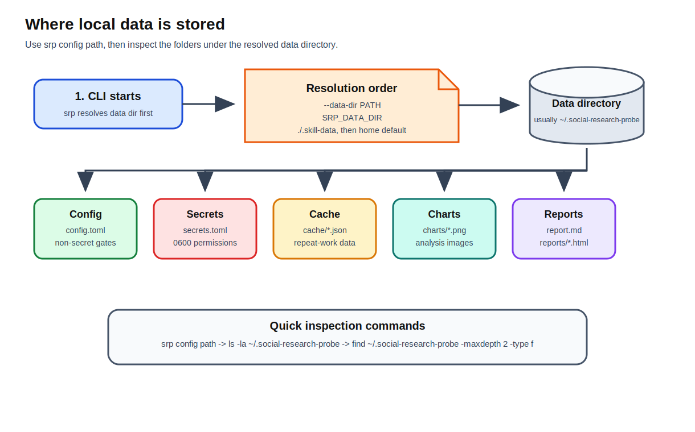

[Back to docs index](README.md)

# Data Directory


The data directory is the local home for config, secrets, state, cache, charts, and reports. Resolve it with `srp config path` or set it with `--data-dir`.

Understanding this directory is important because the project is local-first. Most behavior that feels "persistent" is stored here: saved topics, saved purposes, cached provider outputs, rendered charts, and generated reports.



## How to find the active directory

Run:

```bash
srp config path
```

Example output:

```text
config: /Users/you/.social-research-probe/config.toml
secrets: /Users/you/.social-research-probe/secrets.toml
```

The data directory is the parent directory of those paths:

```text
/Users/you/.social-research-probe
```

On macOS and Linux, `~` means your home directory. These two paths point to the same place:

```text
~/.social-research-probe
/Users/you/.social-research-probe
```

The CLI resolves the data directory before every command. Resolution order is:

| Priority | Source | Example |
| --- | --- | --- |
| 1 | Global `--data-dir` flag | `srp --data-dir ./research-data config path` |
| 2 | `SRP_DATA_DIR` environment variable | `SRP_DATA_DIR=./research-data srp config path` |
| 3 | Workspace `.skill-data` folder if it already exists | `./.skill-data` |
| 4 | Home default | `~/.social-research-probe` |

Use `--data-dir` for one command. Use `SRP_DATA_DIR` for a shell session. Use `.skill-data` when a project workspace should keep its own config, cache, charts, and reports.

## Files and folders

| Path | Purpose |
| --- | --- |
| `config.toml` | Non-secret user configuration. |
| `secrets.toml` | Secret values, written with `0600` permissions. |
| `topics.json` | Saved topic names. |
| `purposes.json` | Saved purpose definitions. |
| `pending_suggestions.json` | Staged topic and purpose suggestions. |
| `cache/transcripts` | Transcript cache. |
| `cache/whisper` | Whisper fallback cache. |
| `cache/summaries` | LLM summary cache. |
| `cache/corroboration` | Provider evidence cache. |
| `cache/classification` | Query classification cache. |
| `cache/stages/*` | Stage-level cached outputs. |
| `charts/*.png` | Rendered chart PNGs. |
| `report.md` and `reports/*.html` | Report outputs. |
| `voicebox_profiles.json` | Discovered Voicebox profiles used by HTML/TTS report controls when Voicebox is enabled. |

## Full default layout

A normal home data directory may look like this after several runs:

```text
~/.social-research-probe/
  config.toml
  secrets.toml
  topics.json
  purposes.json
  pending_suggestions.json
  voicebox_profiles.json
  report.md
  reports/
    ai-safety-youtube-20260427-101530.html
    ai-safety-youtube-20260427-101530.voicebox.jarvis-a1b2c3.mp3
  charts/
    overall_score_bar.png
    overall_score_histogram.png
    trust_vs_opportunity_scatter.png
    top_n_summary_table.png
  cache/
    transcripts/
      VIDEO_ID.json
    whisper/
      HASH.json
    summaries/
      HASH.json
    corroboration/
      HASH.json
    classification/
      HASH.json
    stages/
      fetch/
        HASH.json
      analyze/
        HASH.json
```

Not every file appears immediately. The directory grows based on which commands and services have run. For example, `charts/` appears after chart generation, `reports/` appears after HTML report generation, and `voicebox_profiles.json` appears only when Voicebox profile discovery runs.

## How to inspect what exists

Find the data directory:

```bash
srp config path
```

List the top-level files and folders:

```bash
ls -la ~/.social-research-probe
```

List generated reports:

```bash
find ~/.social-research-probe/reports -maxdepth 1 -type f
```

List rendered charts:

```bash
find ~/.social-research-probe/charts -maxdepth 1 -type f
```

List cache namespaces:

```bash
find ~/.social-research-probe/cache -maxdepth 2 -type d
```

Find recently changed files:

```bash
find ~/.social-research-probe -type f -mtime -1
```

Use a custom data directory for the same checks:

```bash
srp --data-dir ./research-data config path
find ./research-data -maxdepth 2 -type f
```

## What each stored item means

| Item | Created by | How to read it |
| --- | --- | --- |
| `config.toml` | `srp setup`, `srp config set`, or manual creation. | User-editable non-secret settings: platforms, stage gates, service gates, technology gates, LLM runner, tunables, and Voicebox defaults. |
| `secrets.toml` | `srp setup` or `srp config set-secret`. | Secret provider keys. Do not paste this into issues, docs, logs, or commits. |
| `topics.json` | Topic commands and setup defaults. | Saved topic names used by topic-management commands. |
| `purposes.json` | Purpose commands and setup defaults. | Saved research purposes and evidence priorities. |
| `pending_suggestions.json` | Suggestion commands. | Staged suggestions waiting for `apply-pending` or `discard-pending`. |
| `cache/transcripts` | Transcript fetching. | Cached transcript text by video/source key. |
| `cache/whisper` | Whisper fallback transcription. | Cached local transcription results. |
| `cache/summaries` | LLM summary service. | Cached generated summaries keyed by input and prompt. |
| `cache/corroboration` | Corroboration host. | Cached claim-check results keyed by claim text and provider set. |
| `cache/classification` | Natural-language query classification. | Cached topic/purpose classification results. |
| `cache/stages/fetch` | Platform fetch stages. | Cached source fetch output when a stage uses stage caching. |
| `cache/stages/analyze` | Statistics and chart services. | Cached analysis results keyed by scored dataset. |
| `charts/*.png` | Chart service. | Rendered chart images used by reports and chart docs. |
| `report.md` | Markdown fallback report writer. | Most recent Markdown fallback report. This file can be overwritten by later runs. |
| `reports/*.html` | HTML report renderer. | Timestamped HTML reports. These are the easiest reports to open and share after review. |
| `reports/*.voicebox.*.mp3` | Voicebox audio preparation. | Optional per-report audio files when audio reporting is enabled and Voicebox is available. |
| `voicebox_profiles.json` | HTML report renderer. | Cached list of discovered Voicebox profile names for report controls. |

## Finding missing charts

If a report references charts but the images are missing, check:

```bash
srp config path
ls -la ~/.social-research-probe/charts
find ~/.social-research-probe/cache/stages/analyze -maxdepth 1 -type f
```

Then check configuration:

```bash
srp config show
```

Relevant gates:

```toml
[stages.youtube]
charts = true

[services.youtube.analyzing]
charts = true
statistics = true
```

If `charts/` is empty but `cache/stages/analyze/` has files, the analysis stage may have reused cached chart metadata. Re-run with cache disabled when you need fresh chart files:

```bash
SRP_DISABLE_CACHE=1 srp research youtube "ai safety" "market-research"
```

## Finding missing reports

HTML reports are written under:

```text
~/.social-research-probe/reports/
```

Markdown fallback is written to:

```text
~/.social-research-probe/report.md
```

Check both:

```bash
ls -la ~/.social-research-probe/reports
ls -la ~/.social-research-probe/report.md
```

If `reports/` is empty, HTML may be disabled or failed. Check:

```toml
[stages.youtube]
report = true

[services.youtube.reporting]
html = true
audio = true
```

The command output may also print a local serve command, for example:

```text
[srp] Serve report: srp serve-report --report /Users/you/.social-research-probe/reports/ai-youtube-20260427-101530.html
```

Use that path directly:

```bash
srp serve-report --report ~/.social-research-probe/reports/ai-youtube-20260427-101530.html
```

## Finding missing secrets

Do not inspect secrets by pasting them into chat or logs. Use the built-in checker:

```bash
srp config check-secrets --needed-for research --platform youtube --output json
```

Example output:

```json
{
  "required": ["youtube_api_key"],
  "optional": ["brave_api_key", "exa_api_key", "tavily_api_key"],
  "present": ["youtube_api_key", "exa_api_key"],
  "missing": []
}
```

If a key is missing, set it without showing it in shell history:

```bash
srp config set-secret youtube_api_key
```

Or pipe from a password manager:

```bash
printf "%s" "$SRP_YOUTUBE_API_KEY" | srp config set-secret youtube_api_key --from-stdin
```

`secrets.toml` is written with `0600` permissions. If you need to verify permissions:

```bash
ls -l ~/.social-research-probe/secrets.toml
```

The permission bits should look like:

```text
-rw------- ...
```

## Finding missing cache data

Cache files are JSON files. Each cache namespace has a different TTL, so an old file can exist but be ignored as expired.

Useful commands:

```bash
find ~/.social-research-probe/cache -maxdepth 2 -type f
find ~/.social-research-probe/cache -type f -mtime -1
```

Use this mental model:

| Cache | Freshness expectation |
| --- | --- |
| `transcripts` | Long-lived. Transcript text rarely changes. |
| `whisper` | Long-lived. Local transcription is expensive. |
| `summaries` | Long-lived for the same prompt/input. |
| `corroboration` | Short-lived. External evidence can change. |
| `classification` | Medium-lived. Classification saves repeated natural-language parsing. |
| `stages/fetch` | Short-lived. Platform search results change. |
| `stages/analyze` | Medium-lived. Same scored dataset gives same statistics/charts. |

Bypass all caches for one command:

```bash
SRP_DISABLE_CACHE=1 srp research youtube "ai safety" "market-research"
```

Delete only one cache namespace when you need a targeted refresh:

```bash
rm -rf ~/.social-research-probe/cache/corroboration
```

Be careful with deletion. Cache deletion is usually safe, but deleting `config.toml`, `secrets.toml`, `topics.json`, or `purposes.json` changes your setup.

## Best practice

Use a project-local `.skill-data` for experiments you want to keep with a workspace. Use the default home directory for personal long-lived settings.

Do not commit the data directory unless you intentionally want to publish its contents. It can contain research topics, cached transcripts, summaries, external evidence, and generated reports. For open-source examples, prefer small hand-written fixtures instead of real cache output.

## When to delete data

Delete cache entries when you need a fresh provider response or when a cached output was created with a bad configuration. Delete generated reports when they contain sensitive research. Keep `config.toml`, `topics.json`, and `purposes.json` if you want to preserve your workflow settings.

If behavior differs between two machines, compare `srp config path`, `config.toml`, `secrets.toml`, and environment variables first. Most "it works here but not there" issues come from a different data directory or missing provider secret.

## Example layouts

Personal default:

```text
~/.social-research-probe/
  config.toml
  secrets.toml
  topics.json
  purposes.json
  cache/
  charts/
  reports/
```

Project-local experiment:

```text
my-research-project/
  .skill-data/
    config.toml
    topics.json
    purposes.json
    cache/
    charts/
    reports/
```

Use the project-local layout when the research context should stay with a workspace. Use the home layout when you want one personal setup reused across many topics.

## Quick diagnosis table

| Problem | Check first | Why |
| --- | --- | --- |
| Config changes seem ignored. | `srp config path` | You may be editing a different data directory than the CLI is using. |
| API keys seem missing. | `srp config check-secrets --output json` | Environment variables and `secrets.toml` are resolved separately from `config.toml`. |
| Charts are missing. | `~/.social-research-probe/charts` and chart/stat gates. | Charts are generated by the analysis stage and written to the active data directory. |
| HTML report is missing. | `~/.social-research-probe/reports` and HTML/report gates. | HTML can be disabled while Markdown fallback still writes `report.md`. |
| Old evidence keeps appearing. | `cache/corroboration` or `SRP_DISABLE_CACHE=1`. | Corroboration results are cached for repeat runs. |
| Two machines behave differently. | Compare `srp config path`, `config.toml`, `secrets.toml`, and environment variables. | Most differences come from data-dir or secret differences, not code differences. |
