[Back to docs index](README.md)

# Design Patterns

The repository uses a few simple patterns repeatedly. Each one exists to keep source-specific and vendor-specific code away from the core pipeline. The patterns are intentionally ordinary Python patterns, not framework magic.

Read this page as a guide for where new code should go. If a change feels like it needs special cases in many files, one of these boundaries is probably being skipped.

## Pipeline


Why use it: research is naturally staged. Each stage has clear inputs, outputs, config gates, and tests.

What if we did not use it: fetch, scoring, transcripts, charts, corroboration, and reporting would become one large function with hidden ordering rules.

How it is applied:

```python
for group in self.stages():
    if len(group) == 1:
        state = await group[0].run(state)
    else:
        await asyncio.gather(*(s.run(state) for s in group))
```

`BaseStage.run()` wraps `execute()` with stage-level cache-bypass setup and timing. The important idea is that stages communicate through `PipelineState`, not through hidden globals. This makes a run inspectable: fetched items, classified items, scored items, comments, summaries, claims, corroboration, narratives, statistics, charts, exports, and final reports are separate outputs.

## Adapter


Why use it: YouTube APIs, runner CLIs, and search providers all expose different shapes. The pipeline needs one internal shape.

What if we did not use it: every service would contain provider-specific conditionals.

```python
class BaseTechnology(ABC):
    async def execute(self, data):
        if self.enabled_config_key and not cfg.technology_enabled(self.enabled_config_key):
            return None
        return await self._execute(data)
```

Adapters should translate external behavior into internal contracts. They should not leak provider response formats upward. For example, a runner adapter can know how a CLI returns JSON, but the summary service should only see parsed structured output or a clear failure.

## Strategy



Why use it: the same task can be handled by different runners or providers.

What if we did not use it: changing from Gemini to Claude, Codex, Exa, Brave, or Tavily would require editing orchestration code.

```python
providers = auto_mode_providers(cfg) if configured == "auto" else (configured,)
```

Strategy is useful when the user should be able to choose behavior through config. Corroboration can use Exa, Brave, Tavily, LLM search, or no provider. LLM tasks can use different runner CLIs. The caller should not need to change when the selected strategy changes.

## Registry



Why use it: callers ask for a runner/provider by name instead of importing concrete classes.

What if we did not use it: every caller would need a hard-coded `if name == ...` block.

```python
_REGISTRY: dict[str, type[LLMRunner]] = {}

def register(cls):
    _REGISTRY[cls.name] = cls
    return cls
```

A registry is a small lookup table with a clear contract. It is better than importing every concrete class everywhere. It also makes error messages clearer: if a user configures an unknown runner name, the registry can report the available names. The LLM runner registry lives in `utils/llm/registry.py`; the corroboration provider registry lives in `technologies/corroborates/__init__.py`.

## Service and technology result objects


Why use it: each technology call can fail independently while the service returns a structured result.

What if we did not use it: one provider error could abort unrelated work, or failures would be hidden in logs only.

The result-object pattern is especially important for research workflows because partial output is still useful. If chart rendering fails, the report can still include scored items and summaries. If one corroboration provider fails, another provider may still return evidence. Structured results make those partial successes visible.

Current service subclasses implement `_get_technologies()` and `execute_service()`. They do not override `execute_batch()` or `execute_one()`; `BaseService` owns that lifecycle so every service handles concurrency, timing, disabled gates, and technology failures consistently.

## Fake seam for tests



Why use it: integration tests need deterministic YouTube-like data without network access.

What if we did not use it: tests would be slow, flaky, and dependent on external APIs.

The fake seam should mimic the platform contract, not the entire provider. Tests should prove that the pipeline can consume normalized platform items. They should not depend on live search ranking, changing external metadata, or paid provider availability.

## Pattern selection guide

| Situation | Pattern to use | Reason |
| --- | --- | --- |
| A workflow has ordered steps and some can run in parallel. | Pipeline. | Keeps stage order explicit and testable. |
| An external system has a different API shape. | Adapter. | Keeps provider-specific details out of services. |
| A user can choose one implementation from several. | Strategy. | Keeps selection in config rather than code branches. |
| Implementations need to be found by name. | Registry. | Centralizes lookup and validation. |
| A provider can fail without invalidating the whole run. | Service/technology results. | Preserves partial output and error context. |
| Integration tests need source-like data. | Fake seam. | Avoids live network and credential dependence. |
