[Back to docs index](README.md)

# LLM Runners



`srp` does not embed a model SDK. It shells out to configured runner CLIs through adapter classes. The active config key is `llm.runner`.

Runner output is used for generated text tasks such as summaries, synthesis, and runner-backed search when the selected runner supports it. The rest of the pipeline should still be useful without a runner: fetching, scoring, statistics, charts, cache, and basic reports are local or provider-specific tasks.

For account setup, key behavior, and cost implications, read [API costs and keys](api-costs-and-keys.md).

## Supported runner names

| Runner | Implementation | Typical use |
| --- | --- | --- |
| `none` | no runner | Fully local scoring, stats, charts, and reports with no generated synthesis. |
| `claude` | `technologies/llms/claude_cli.py` | Claude CLI structured tasks and search if available. |
| `gemini` | `technologies/llms/gemini_cli.py` | Gemini CLI structured tasks and grounded search if available. |
| `codex` | `technologies/llms/codex_cli.py` | Codex CLI structured tasks and search if available. |
| `local` | `SRP_LOCAL_LLM_BIN` stdin/stdout wrapper | Local model experimentation without hosted model API calls. |


## Default model flags

Each runner has default `extra_flags` in `DEFAULT_CONFIG` so srp does not rely on a CLI's automatic model choice.

| Runner | Default flag | Model |
| --- | --- | --- |
| `claude` | `--model claude-haiku-4-5` | Claude Haiku 4.5 |
| `gemini` | `--model gemini-2.5-flash-lite` | Gemini 2.5 Flash Lite |
| `codex` | `--model gpt-5.4` | GPT-5.4 |

Override per-runner in `config.toml`:

```toml
[llm.claude]
extra_flags = ["--model", "MODEL_SUPPORTED_BY_YOUR_CLAUDE_CLI"]
```

Runner CLIs change over time. Treat these defaults as project configuration,
not as a guarantee that a vendor will keep accepting a model name forever.
Verify the model flag against the installed CLI when upgrading runners.

## How it works

Runner modules register concrete classes. Callers ask the registry for a runner by name. The runner builds an argv list, sends the prompt through stdin or args, enforces timeout through the subprocess helper, and parses JSON output.

This means the runner contract is about behavior, not a vendor SDK. A runner must accept a prompt, produce structured output the caller can parse, fail clearly when unavailable, and respect configured timeouts. If a CLI changes its output format, the adapter is the only place that should need adjustment.

## Tradeoffs

CLI adapters avoid hard SDK dependencies and let users authenticate with their normal CLI tools. The cost is that runner health depends on binaries on `PATH`, CLI output shape, and subprocess timeouts.

Choose `none` when you want deterministic local behavior or when no model access should happen. Choose a hosted runner CLI when you need stronger summaries or synthesis. Choose a local runner only when you have a local model setup that can follow the expected structured-output prompts well enough for the task.

## Troubleshooting runner behavior

If summaries or synthesis are missing, first check `srp config show` for `llm.runner`. Then confirm the runner binary exists on `PATH` and can run outside `srp`. If the runner works manually but fails in the pipeline, inspect timeout settings and whether the runner returned valid JSON for the task.

## What runners should and should not decide

Runners can transform evidence into summaries, synthesis, or search-backed corroboration results. They should not decide which platform items exist, where config lives, which cache keys are valid, or whether a provider is enabled. Those decisions belong to the pipeline, config, and service layers.

Keeping this boundary matters because model output is variable. The deterministic parts of the system should prepare stable inputs and validate structured outputs. The runner should be treated as a powerful but fallible text engine, not as the owner of the workflow.
