[Back to docs index](README.md)

# Objective

Social Research Probe is a local-first research CLI for turning platform search results into ranked evidence, statistics, corroboration, charts, and a report. The project goal is broad social and web research across many sources. YouTube is only the first implemented platform adapter; the rest of the pipeline is designed to stay platform-neutral.

## Why this was built

Online platforms contain useful signals, but raw feeds are hard to audit. A researcher usually has to search, copy links, compare creators or sources, fetch transcripts or excerpts, ask an LLM for summaries, check claims, build charts, and write a report. That work is repetitive, easy to do inconsistently, and hard to explain later.

This project automates the repeatable parts while keeping the human in charge of the research question and interpretation. The tool can collect, normalize, score, enrich, and summarize evidence, but it does not decide what the final conclusion must be. The report is meant to make the research trail easier to inspect.

The design goal is not to replace judgment. The goal is to produce a traceable first pass: what was fetched, why it ranked highly, what evidence was available, which claims were checked, and where the final report came from.

## Who it is for

Use it when you need repeatable exploratory research across online platforms: analysts, journalists, builders, content researchers, and developers studying how a topic is moving through social media, video platforms, search results, and public web sources. It is especially useful when you care about cost control and want local scoring, local statistics, and cached outputs before paying for LLM work.

It is not meant to be a fully managed social listening product. It is a local research assistant for people who want to see the intermediate evidence, control which providers are called, and keep project data in a normal filesystem directory.

## What it optimizes for

| Goal | Design choice | Tradeoff |
| --- | --- | --- |
| Repeatability | A staged pipeline writes deterministic intermediate data. | The CLI is more structured than an ad-hoc notebook. |
| Low cost | Only top-N items need transcript, summary, and corroboration work. | A useful result outside top-N can be missed unless you raise `enrich_top_n`. |
| Vendor flexibility | LLM runners and corroboration providers are adapters. | Every adapter must preserve the internal contract. |
| Local control | Config, cache, reports, and charts live under the data directory. | Users must manage local dependencies and credentials. |

## Platform scope

The current implemented platform is YouTube. That means the active adapter fetches YouTube results, normalizes them into the shared item shape, enriches the top results, and then passes them into the common scoring, statistics, charting, corroboration, synthesis, and reporting pipeline.

The long-term direction is to support additional platforms such as TikTok, Instagram, X, web search, RSS, forums, and other public sources. New platforms should reuse the shared scoring, analysis, synthesis, reporting, config, and cache layers instead of rebuilding the whole research pipeline. See [Adding a platform](adding-a-platform.md).

The important boundary is the normalized item contract. Once a platform can provide item identity, source metadata, timestamps, URLs, text or transcript material, and engagement-style features, the rest of the system can analyze it without needing to know where it came from.

## What a good run should answer

| Question | Where the answer comes from |
| --- | --- |
| What did the platform return for this topic? | Fetch output and source item list. |
| Why did these items rank highest? | Trust, trend, opportunity, and overall scores. |
| What evidence was available inside the sources? | Transcripts, excerpts, metadata, and item summaries. |
| Which claims need more confidence? | Corroboration results and missing-evidence notes. |
| Is the result set stable or skewed? | Statistics and charts. |
| What should a human inspect next? | Report synthesis, outliers, and top-ranked item details. |

This is why the project produces a packet and report instead of only a chat answer. A chat answer is hard to audit after the fact. A packet can preserve the inputs, intermediate outputs, and final interpretation.
