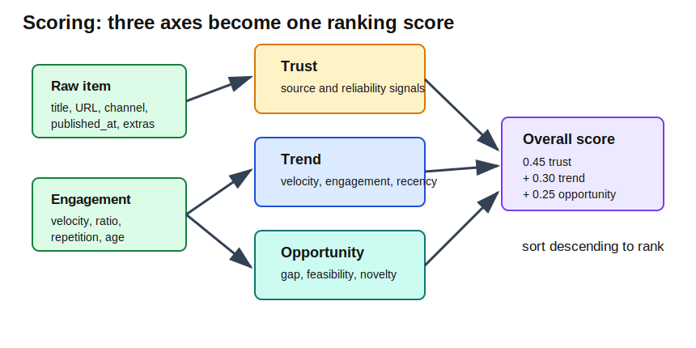
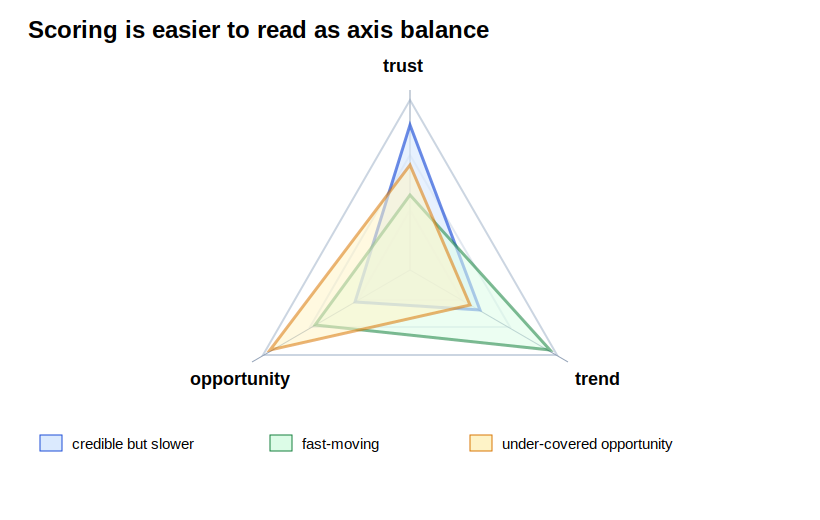
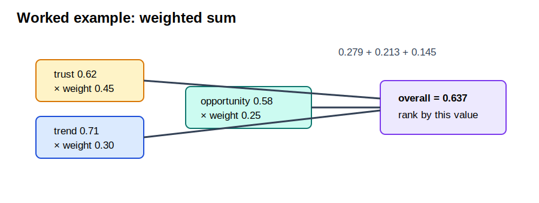

[Back to docs index](README.md)

# Scoring


Scoring is the step that turns fetched platform items into a ranked list. It
does not decide whether a claim is true. It decides which items look most useful
for the configured research purpose based on currently available signals.

The current scoring implementation lives in:

| Area | File |
| --- | --- |
| Scoring orchestration | `social_research_probe/services/scoring/compute.py` |
| Trust formula | `social_research_probe/technologies/scoring/trust.py` |
| Trend formula | `social_research_probe/technologies/scoring/trend.py` |
| Opportunity formula | `social_research_probe/technologies/scoring/opportunity.py` |
| Overall formula and default weights | `social_research_probe/technologies/scoring/combine.py` |
| Weight resolution | `social_research_probe/services/scoring/weights.py` |





The formula view explains how the code calculates scores. The axis-balance view
explains how a human should read them. Two items can have similar overall scores
for very different reasons: one may be highly trusted but slow-moving, while
another may be trending quickly but need more corroboration.

## What scoring produces

Each scored item receives:

| Field | Meaning |
| --- | --- |
| `source_class` | Source type label: `primary`, `secondary`, `commentary`, or `unknown`. Set by the classify stage before scoring. |
| `scores.trust` | Reliability-oriented score from source and credibility signals. |
| `scores.trend` | Momentum score from velocity, engagement, repetition, and recency. |
| `scores.opportunity` | Usefulness/opportunity score from market gap, monetization proxy, feasibility, and novelty. |
| `scores.overall` | Weighted combination of trust, trend, and opportunity. |
| `features.view_velocity` | Views per day or equivalent platform velocity signal. |
| `features.engagement_ratio` | Engagement divided by views, with safe handling for zero views. |
| `features.age_days` | Age of the item in days. |
| `features.subscriber_count` | Source/channel size when available. |

After these fields are added, items are sorted by `scores.overall` descending.
The top items become the main candidates for transcript fetching, summarization,
corroboration, and deeper report work.

## Input normalization

Scoring accepts raw platform items and engagement metrics. The current YouTube
adapter uses `RawItem` objects, but the scoring code first normalizes each item
into a dictionary with fields such as id, URL, title, author, published date,
metrics, text excerpt, thumbnail, and extras.

This normalization step matters because future platforms should be able to feed
the same scoring service after they provide equivalent fields. Scoring should
not care whether the item came from YouTube, TikTok, Instagram, X, web search,
RSS, or another source once the item has been normalized.

## Engagement features

The source stage computes engagement metrics before scoring. For the current
YouTube implementation:

```text
view_velocity = views / age_days
engagement_ratio = (likes + comments) / max(1, views)
```

`max(1, views)` prevents division by zero. If a video has zero views or missing
view data, the denominator is at least `1`.

The scoring service also stores `age_days` and `subscriber_count` in the final
`features` dictionary so later statistics and charts can inspect them.

## Z-scores

Trend scoring uses z-scores for view velocity and engagement ratio:

```text
z = (value - mean) / standard_deviation
```

A z-score says how unusual a value is inside the current fetched result set.
Positive z-scores are above the current average. Negative z-scores are below it.

If there are fewer than two values, the code returns `0.0` for every z-score.
That means tiny result sets do not pretend to know what is unusually high or
low.

## Trust score

Trust uses this formula:

```text
trust =
  0.35 * source_class
+ 0.25 * channel_credibility
+ 0.15 * citation_traceability
+ 0.15 * (1 - ai_slop_penalty)
+ 0.10 * corroboration_score
```

Then the result is clipped into `[0.0, 1.0]`.

Current scoring orchestration supplies these values:

| Signal | Current value or source |
| --- | --- |
| `source_class` | `0.4` |
| `channel_credibility` | Derived from subscriber count. |
| `citation_traceability` | `0.3` |
| `ai_slop_penalty` | `0.0` |
| `corroboration_score` | `0.3` |

Channel credibility is:

```text
0.3 when subscriber count is missing or zero
min(1.0, 0.15 * log10(subscribers))
```

Interpretation:

| Trust is high when | Trust is low when |
| --- | --- |
| Source/channel signals are stronger. | Source/channel signals are weak or missing. |
| The item is less penalized for low-quality generated content. | Future slop penalties or weak credibility lower the score. |
| Corroboration-like signals are stronger. | Corroboration-like signals are weak or unavailable. |

Important limitation: the current trust inputs include placeholders for some
signals. Treat trust as a useful ranking heuristic, not a final truth verdict.

## Trend score

Trend uses this formula:

```text
trend =
  0.40 * norm_z(view_velocity_z)
+ 0.20 * norm_z(engagement_ratio_z)
+ 0.20 * norm_z(cross_channel_repetition_z)
+ 0.20 * recency_decay(age_days)
```

`norm_z` maps a z-score into `[0.0, 1.0]`:

```text
norm_z(z) = clip(0.5 + z / 6.0)
```

Recency decay is:

```text
recency_decay(age_days) = exp(-age_days / 30)
```

Interpretation:

| Trend signal | Meaning |
| --- | --- |
| High view velocity | The item is getting views quickly relative to this result set. |
| High engagement ratio | Viewers interact with it more than usual. |
| High cross-channel repetition | The theme appears repeatedly across sources. |
| Low age | Newer items receive more recency credit. |

Trend is relative to the fetched set. A video can have a high trend score in one
query and a lower one in another if the surrounding candidates are stronger.

## Opportunity score

Opportunity uses this formula:

```text
opportunity =
  0.40 * market_gap
+ 0.30 * monetization_proxy
+ 0.20 * feasibility
+ 0.10 * novelty
```

Current scoring orchestration supplies:

| Signal | Current computation |
| --- | --- |
| `market_gap` | `max(0.0, 1.0 - cross_channel_repetition)` |
| `monetization_proxy` | `min(1.0, engagement_ratio * 20)` |
| `feasibility` | `0.5` |
| `novelty` | `max(0.0, 1.0 - age_days / 180.0)` |

Interpretation:

| Opportunity is high when | Opportunity is low when |
| --- | --- |
| The item has strong engagement but is not repeated everywhere. | The topic is already saturated across sources. |
| The item is relatively fresh. | The item is old enough that novelty has decayed. |
| Engagement suggests audience interest. | Engagement is weak or missing. |

Opportunity is not the same as truth or popularity. It is a signal that the item
may be useful, under-covered, or worth deeper review.

## Overall score

The final score is:

```text
scores.overall =
  0.45 * trust
+ 0.30 * trend
+ 0.25 * opportunity
```

Then the value is clipped into `[0.0, 1.0]`.

Default weights are:

| Axis | Default weight |
| --- | --- |
| `trust` | `0.45` |
| `trend` | `0.30` |
| `opportunity` | `0.25` |

Trust has the largest default weight because the project favors evidence quality
over raw momentum. Trend still matters because research often cares about what
is moving now. Opportunity matters because a useful source is not always the
most popular one.

## Weight overrides

Weights are resolved in this order:

1. Built-in defaults from `DEFAULT_WEIGHTS`.
2. `[scoring.weights]` in config.
3. Purpose-specific `scoring_overrides`.

Later values override earlier values. Only these keys are recognized:
`trust`, `trend`, and `opportunity`.

Example config:

```toml
[scoring.weights]
trust = 0.60
trend = 0.25
opportunity = 0.15
```

Use higher trust when researching sensitive or high-risk topics. Use higher
trend when researching breaking or fast-moving topics. Use higher opportunity
when looking for emerging gaps, under-covered sources, or content strategy
angles.

## Worked example

Assume one item has:

| Axis | Value |
| --- | --- |
| `trust` | `0.62` |
| `trend` | `0.71` |
| `opportunity` | `0.58` |

Default overall score:



```text
(0.45 * 0.62) + (0.30 * 0.71) + (0.25 * 0.58)
= 0.279 + 0.213 + 0.145
= 0.637
```

The item would be ranked against other scored items by that final value.

## Missing data behavior

The scoring code uses safe defaults when data is missing:

| Missing value | Default behavior |
| --- | --- |
| Missing engagement metrics | Velocity, engagement, and repetition become `0.0`. |
| Missing published date | Age defaults to `30` days. |
| Missing subscriber count | Channel credibility defaults to `0.3`. |
| Too few values for z-score | Z-score becomes `0.0`. |

These defaults keep the pipeline running, but they also lower confidence. A
source with missing metrics may rank lower because the system cannot observe its
momentum or credibility signals.

## How to read scoring in reports

Read the three axes before trusting the overall score:

| Pattern | Interpretation |
| --- | --- |
| High trust, high trend, high opportunity | Strong candidate for deep review. |
| High trust, low trend | Credible source, but not currently moving much. |
| Low trust, high trend | Popular or fast-moving, but needs corroboration. |
| High opportunity, low repetition | Possibly under-covered or emerging. |
| High overall from one axis only | Inspect manually; the final score may hide imbalance. |

Scoring is a prioritization tool. It helps decide what to enrich and inspect
first. It should not be used as the only basis for a final research conclusion.

## Why scoring happens before enrichment

Transcript fetching, LLM summaries, and corroboration can be slow or expensive.
Scoring happens first so the pipeline can spend those heavier operations on the
most promising items. This is the top-N enrichment design used throughout the
project.

The tradeoff is recall. If the scoring formula under-ranks a valuable item, that
item may not receive transcript, summary, or corroboration work unless
`enrich_top_n` is raised.
