[Back to docs index](README.md)

# Security

Social Research Probe is local-first, but optional providers call external systems. Treat topics, transcripts, summaries, reports, and provider queries as potentially sensitive.

The safest mental model is: files stay local unless you configure a provider, runner, or platform API that must receive data to do its job. The tool tries to make those boundaries explicit through config keys, secrets, and technology gates.

## Secret handling

Secrets are read from environment variables first, then `secrets.toml`. Environment variables use names like `SRP_YOUTUBE_API_KEY`. The secrets file is written with `0600` permissions and `config show` masks values.

Prefer environment variables for CI and short-lived sessions. Prefer `secrets.toml` for local development when you want the data directory to remember provider keys. Do not put secrets in `config.toml`, topic files, purpose files, or command history if you can avoid it.

## Trust boundaries

| Boundary | Risk | Mitigation |
| --- | --- | --- |
| YouTube/search APIs | Queries and URLs leave the machine. | Disable technologies you do not want to call. |
| Runner CLIs | Prompts are sent to the configured runner. | Use `llm.runner = "none"` for no LLM calls. |
| HTML reports | Reports may contain external links and generated text. | Review before sharing. |
| Local cache | Cached evidence may contain sensitive research topics. | Use project data dirs and delete cache when needed. |

## Best practice

Use separate data directories for sensitive projects. Prefer environment variables for ephemeral secrets in CI. Do not commit `.skill-data`, `secrets.toml`, reports, or cache contents unless you intentionally want to publish them.

## What leaves the machine

Platform search APIs receive the topic and platform-specific request parameters. Transcript and metadata providers receive item identifiers or URLs. LLM runners receive prompts containing selected evidence. Corroboration providers receive claim text or search queries derived from claims.

If a project is sensitive, start with `llm.runner = "none"` and disable external corroboration technologies. Then enable one provider at a time only when you are comfortable with the data it will receive.

## Sharing reports safely

Before sharing an HTML or Markdown report, review source URLs, generated summaries, corroboration excerpts, and charts. Reports can contain claims from source material and model-generated synthesis. Sharing a report is equivalent to sharing the research trail, not just the final conclusion.

## Threat model in plain English

| Concern | Example | Mitigation |
| --- | --- | --- |
| Accidental provider disclosure | A sensitive topic is sent to a search API. | Disable that provider or run with local-only settings. |
| Secret leakage | `secrets.toml` is committed. | Keep data dirs out of git and prefer env vars in CI. |
| Report oversharing | A report contains source links or sensitive summaries. | Review reports before sending them outside the project. |
| Cache persistence | Old evidence remains on disk after a project ends. | Delete the project data directory or targeted cache folders. |
| Model overconfidence | Generated synthesis states weak evidence too strongly. | Check corroboration and edit final synthesis when needed. |

Security in this project is mostly about explicit boundaries. Know which integrations are enabled, where data is stored, and which generated artifacts you share.
