[Back to docs index](README.md)

# Statistics

Statistics are computed after the pipeline has collected, enriched, and scored
research items. The statistics service does not change the ranking. It reads
the scored items, derives aligned target arrays, runs the automatic selector,
and returns human-readable highlight captions for reports.

Use statistics to understand the shape of the current result set: center,
spread, trend, outliers, and relationships between numeric signals. Do not read
them as causal proof. A statistic can tell you that `trust` and `overall` move
together in this run; it cannot prove trust caused the ranking by itself.

## Data Used

Each scored item becomes one row. Derived target arrays keep the same row order,
so `overall[3]`, `trust[3]`, `view_velocity[3]`, and `age_days[3]` describe the
same item.

| Target | Type | How it is built | How to interpret it |
| --- | --- | --- | --- |
| `rank` | Ordinal | Zero-based index in the scored list. | Lower rank means the item appears earlier in the final ranking. |
| `is_top_n` | Binary | `1` when `rank < 5`, otherwise `0`. | Useful for models that ask what separates the top five from the rest. |
| `is_top_tenth` | Binary | `1` when the item is inside the top tenth of the list, with a minimum cutoff of two. | Useful for larger result sets where "top five" is too blunt. |
| `overall` | Continuous score | `scores.overall` from the scoring stage. | Final ranking score. Higher means the item is more useful for the query. |
| `trust` | Continuous score | `scores.trust` from the scoring stage. | Higher means stronger source or reliability signal. |
| `trend` | Continuous score | `scores.trend` from the scoring stage. | Higher means stronger recency or momentum signal. |
| `opportunity` | Continuous score | `scores.opportunity` from the scoring stage. | Higher means the item may be useful despite not being obvious from popularity alone. |
| `view_velocity` | Continuous feature | `features.view_velocity`. | Approximate views per day. High values mean fast audience growth. |
| `engagement_ratio` | Continuous feature | `features.engagement_ratio`. | Engagement relative to views. High values mean viewers interact more often. |
| `age_days` | Continuous feature | `features.age_days`. | Days since upload. Larger values mean older items. |
| `subscribers` | Continuous feature | `features.subscriber_count`. | Channel size. Large values can explain popularity but can also hide small-channel opportunities. |
| `views` | Count-like feature | `view_velocity * age_days`. | Estimated total views from available derived features. |
| `source_class` | Categorical | Item `source_class`, defaulting to `unknown`. | Lets classification or grouped analysis compare source types. |
| `event_crossed_100k` | Binary event | `1` when estimated `views >= 100000`. | Used for event-style analysis such as crossing 100k views. |
| `time_to_event_days` | Event time | Same value as `age_days`. | Used with event indicators for survival-style analysis. |

The automatic report suite currently runs on these numeric targets:
`overall`, `trust`, `trend`, `opportunity`, `view_velocity`,
`engagement_ratio`, `age_days`, `subscribers`, and `views`.

## Automatic Selector

The selector runs more statistics as the sample gets larger.

| Data size | Analyses selected |
| --- | --- |
| 1 or more values | Descriptive statistics: mean, median, min, max, and standard deviation when possible. |
| 2 or more values | Spread and regression over result order. |
| 3 or more values | Growth and outlier checks. |

The report marks `low_confidence: true` when fewer than five scored items are
available. That does not mean the numbers are wrong. It means the sample is too
small for strong interpretation.

## Automatic Statistics

These are the statistics that the report selector can run automatically for
each available numeric target.

### Mean

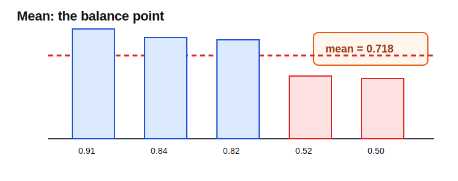

| Field | Value |
| --- | --- |
| Output name | `mean` |
| Runs when | The target has at least one value. |
| Measures | Arithmetic average: `sum(values) / count(values)`. |
| Best for | A quick center point when values are not dominated by extremes. |
| Be careful when | A few very high or very low values pull the average away from most items. |

Example: for `overall = [0.91, 0.84, 0.82, 0.52, 0.50]`, the mean is `0.718`.
That says the average item is moderately strong, but it hides the gap between
the top three and bottom two values.

### Median

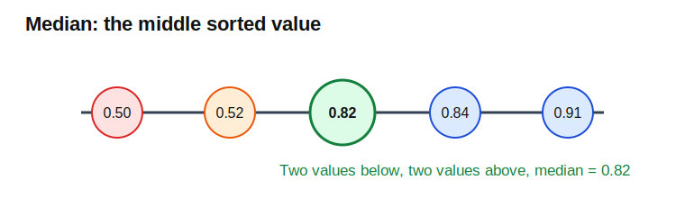

| Field | Value |
| --- | --- |
| Output name | `median` |
| Runs when | The target has at least one value. |
| Measures | The middle value after sorting. |
| Best for | A robust center point when popularity or engagement is skewed. |
| Be careful when | The sample is very small; one added item can move the median. |

Example: for sorted `overall = [0.50, 0.52, 0.82, 0.84, 0.91]`, the median is
`0.82`. The median is higher than the mean, so the weaker bottom values are
pulling the mean down.

### Minimum, Maximum, And Range

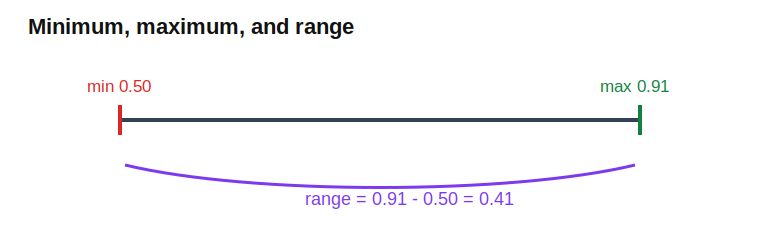

| Field | Value |
| --- | --- |
| Output names | `min`, `max`, `range` |
| Runs when | Min and max run with at least one value. Range is part of spread analysis. |
| Measures | The lowest value, highest value, and full distance between them. |
| Best for | Seeing the outer bounds of the result set. |
| Be careful when | One unusual item makes the whole dataset look more spread out than it usually is. |

Example: for `overall = [0.91, 0.84, 0.82, 0.52, 0.50]`, min is `0.50`, max is
`0.91`, and range is `0.41`. That shows a wide gap between strongest and
weakest items, but it does not describe where the middle values sit.

### Standard Deviation

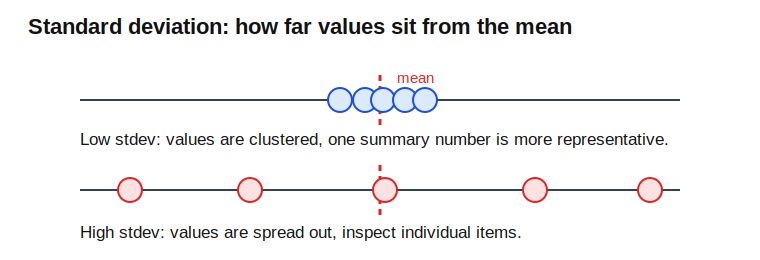

| Field | Value |
| --- | --- |
| Output name | `stdev` |
| Runs when | The target has at least two values. |
| Measures | Typical distance from the mean. |
| Best for | Understanding whether values are clustered or volatile. |
| Be careful when | The distribution is skewed or outlier-heavy. |

Low standard deviation means one summary number is more representative. High
standard deviation means individual items matter more. For platform data,
`view_velocity` often has high standard deviation because a few items can grow
much faster than the rest.

### Interquartile Range

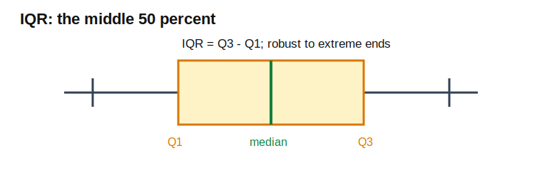

| Field | Value |
| --- | --- |
| Output name | `iqr` |
| Runs when | Spread analysis has enough values for quartiles. |
| Measures | `Q3 - Q1`, the spread of the middle 50 percent of values. |
| Best for | Understanding spread without letting extreme values dominate. |
| Be careful when | The dataset is too small for stable quartiles. |

Use IQR with median when the data is skewed. If `view_velocity` has one viral
item and many normal items, IQR usually describes the normal middle better than
range.

### Linear Slope And R-Squared

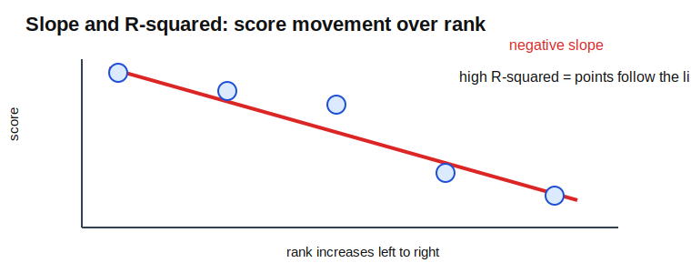

| Field | Value |
| --- | --- |
| Output names | `slope`, `r_squared` |
| Runs when | Regression has at least two values. |
| Measures | A straight-line fit over result order. Slope gives direction; R-squared gives fit quality. |
| Best for | Checking whether a metric changes smoothly across rank. |
| Be careful when | The relationship is curved, clustered, or dominated by one outlier. |

For `overall`, a negative slope is usually expected because scores should fall
as rank gets worse. High R-squared means the score drop is smooth. Low R-squared
means rank order does not explain that metric well.

### Average Growth Rate

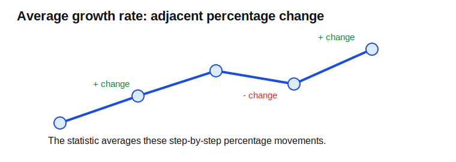

| Field | Value |
| --- | --- |
| Output name | `avg_growth_rate` |
| Runs when | Growth analysis has at least three values. |
| Measures | Average period-over-period percentage change between adjacent values. |
| Best for | Seeing whether values tend to rise or fall down the ranked list. |
| Be careful when | Earlier values are close to zero; percentage changes can become very large. |

Growth is about adjacent movement, not long-term platform growth. A positive
growth rate means values tend to increase as the list moves forward. A negative
growth rate means they tend to decrease.

### Outlier Count And Outlier Fraction

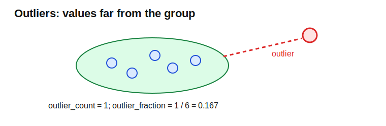

| Field | Value |
| --- | --- |
| Output names | `outlier_count`, `outlier_fraction` |
| Runs when | Outlier analysis has at least three values. |
| Measures | Values far from the group using z-score style distance. |
| Best for | Finding items that deserve manual inspection. |
| Be careful when | Small samples can make outlier labels unstable. |

An outlier can be bad data, a genuinely important source, or evidence that the
query mixed different kinds of content. Treat outliers as review prompts, not
automatic errors.

### Pearson Correlation

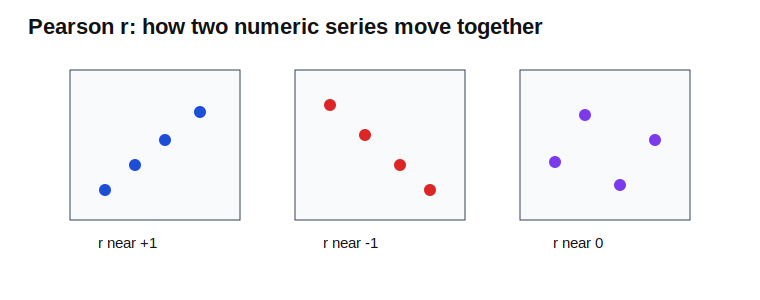

| Field | Value |
| --- | --- |
| Output name | `pearson_r` |
| Runs when | Correlation helper receives two numeric series with at least two paired values. |
| Measures | Linear relationship between two same-length numeric series. |
| Best for | Seeing whether two metrics move together, apart, or independently. |
| Be careful when | The relationship is nonlinear or an outlier drives the result. |

`1.0` means the series move together. `-1.0` means they move in opposite
directions. `0.0` means no linear relationship. A positive correlation between
`trust` and `overall` means the ranking score tends to rise when trust rises,
but it does not prove trust caused the ranking by itself.

## Advanced Modules

These modules exist in `social_research_probe/technologies/statistics/`. They
are available building blocks for deeper analysis, tests, or future report
features. The current statistics report service does not automatically run all
of them on every pipeline result.

### Bootstrap

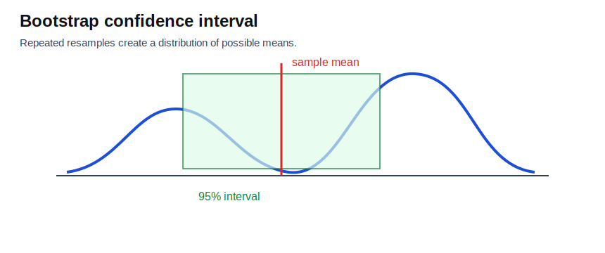

| Field | Value |
| --- | --- |
| Module | `bootstrap` |
| Returns | Bootstrap mean plus lower and upper confidence interval bounds. |
| Use when | The sample is small or skewed and a normal-theory interval would be fragile. |
| Interpret as | Narrow intervals mean the mean is stable; wide intervals mean more data is needed. |

Bootstrap resampling repeatedly samples from the observed values and recomputes
the mean. The spread of those resampled means becomes an uncertainty interval.

### Normality

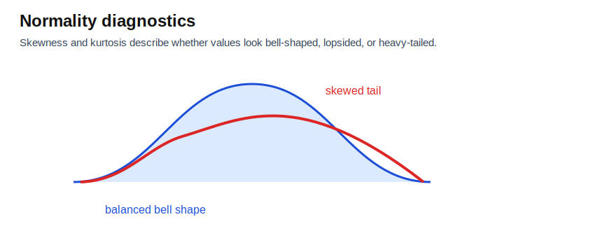

| Field | Value |
| --- | --- |
| Module | `normality` |
| Returns | Skewness, excess kurtosis, and a normality verdict. |
| Use when | You need to know whether normal-assumption methods are reasonable. |
| Interpret as | Skew shows left/right imbalance; high kurtosis means heavy tails or sharp peaks. |

Normality diagnostics help decide whether parametric methods are appropriate.
If values are heavily skewed, prefer robust or rank-based methods.

### Welch T-Test

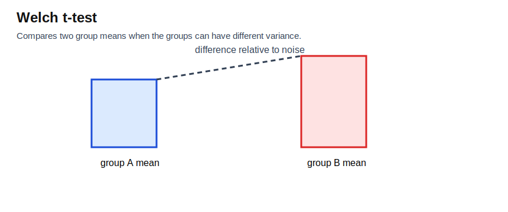

| Field | Value |
| --- | --- |
| Module | `hypothesis_tests.run_welch_t` |
| Returns | Welch t statistic, degrees of freedom, and mean difference. |
| Use when | Comparing two numeric groups with unequal variance. |
| Interpret as | Larger absolute t values suggest stronger group separation. |

Read Welch's test as "is the mean gap large compared with within-group noise?"

### One-Way ANOVA

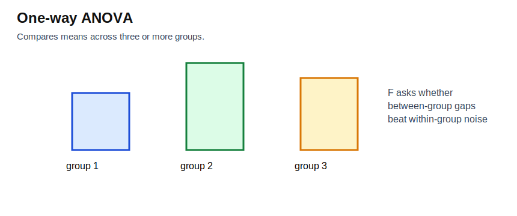

| Field | Value |
| --- | --- |
| Module | `hypothesis_tests.run_anova` |
| Returns | One-way ANOVA F statistic. |
| Use when | Comparing means across three or more groups. |
| Interpret as | Larger F means between-group differences are large relative to within-group noise. |

ANOVA tells you whether group means differ enough to deserve attention. It does
not tell you which pair of groups is responsible without follow-up comparisons.

### Kruskal-Wallis

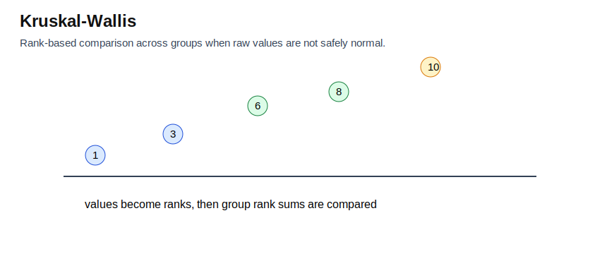

| Field | Value |
| --- | --- |
| Module | `hypothesis_tests.run_kruskal_wallis` |
| Returns | Kruskal-Wallis H statistic. |
| Use when | Comparing groups with a rank-based nonparametric method. |
| Interpret as | Larger H means group distributions are more separated. |

Use Kruskal-Wallis when values are skewed, outlier-heavy, or not safe to treat
as normally distributed.

### Chi-Square

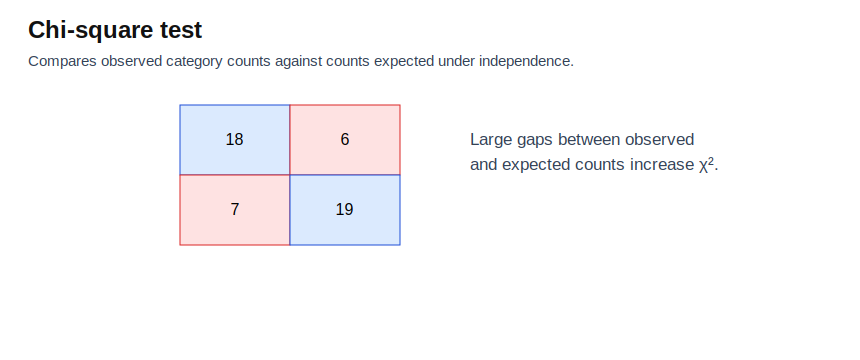

| Field | Value |
| --- | --- |
| Module | `hypothesis_tests.run_chi_square` |
| Returns | Chi-square statistic and degrees of freedom. |
| Use when | Testing association in a categorical contingency table. |
| Interpret as | Larger chi-square means observed counts differ more from independent expectations. |

Chi-square is for counts, not continuous scores. Use it when both variables are
categories.

### Spearman Rank Correlation

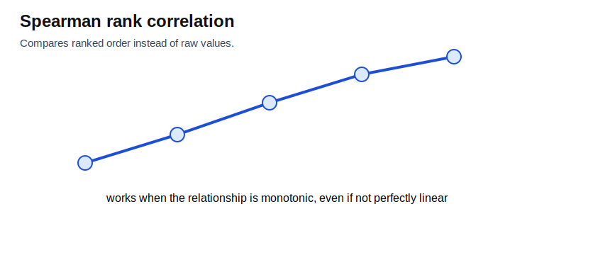

| Field | Value |
| --- | --- |
| Module | `nonparametric.run_spearman` |
| Returns | Spearman rho. |
| Use when | Comparing monotonic relationships when raw values are nonlinear or outlier-heavy. |
| Interpret as | Positive rho means ranks rise together; negative rho means one rank rises as the other falls. |

Spearman compares rank order instead of raw values. It is often safer than
Pearson when the shape is not a straight line.

### Mann-Whitney U

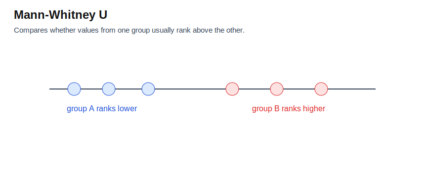

| Field | Value |
| --- | --- |
| Module | `nonparametric.run_mann_whitney` |
| Returns | Mann-Whitney U and z approximation. |
| Use when | Comparing two groups without assuming normal distributions. |
| Interpret as | A small U means one group tends to rank above the other. |

Mann-Whitney answers whether values from one group usually sit higher or lower
than values from another group.

### Multiple Regression

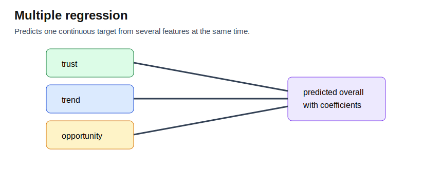

| Field | Value |
| --- | --- |
| Module | `multi_regression` |
| Returns | Intercept, feature coefficients, R-squared, and adjusted R-squared. |
| Use when | Explaining a continuous target with multiple numeric features. |
| Interpret as | Coefficients show feature direction while holding other included features in the model. |

Adjusted R-squared penalizes extra features. Prefer it when comparing models
with different numbers of inputs.

### Bayesian Linear Regression

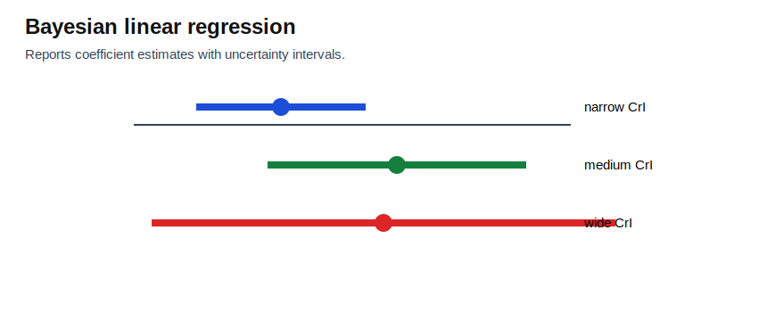

| Field | Value |
| --- | --- |
| Module | `bayesian_linear` |
| Returns | Posterior coefficient means, credible intervals, and residual variance. |
| Use when | Coefficient uncertainty matters, not just point estimates. |
| Interpret as | A credible interval crossing zero means the feature direction is uncertain. |

Wide credible intervals mean the data does not tightly identify the coefficient.

### Huber Regression

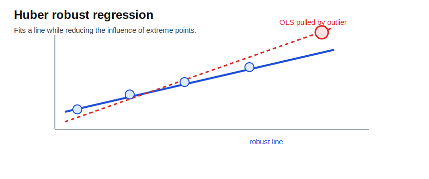

| Field | Value |
| --- | --- |
| Module | `huber_regression` |
| Returns | Robust intercept, slope, and R-squared. |
| Use when | Outliers would distort ordinary least squares. |
| Interpret as | A large difference from OLS means outliers are influencing the simple fit. |

Huber regression is useful when a few unusual items should not fully control
the fitted line.

### Polynomial Regression

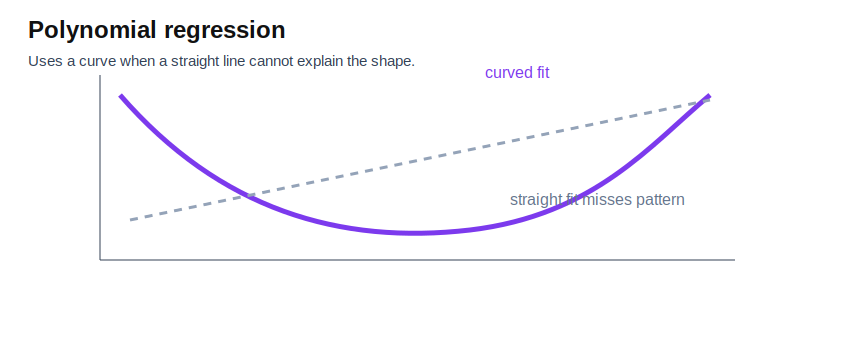

| Field | Value |
| --- | --- |
| Module | `polynomial_regression` |
| Returns | Polynomial R-squared and leading coefficient. |
| Use when | Detecting curved relationships, such as a sharp drop after the first few ranks. |
| Interpret as | Higher R-squared than linear regression means a curve explains the pattern better. |

Use polynomial regression when a straight line is visibly missing the structure.
Do not use higher-degree curves as proof without enough data.

### Logistic Regression

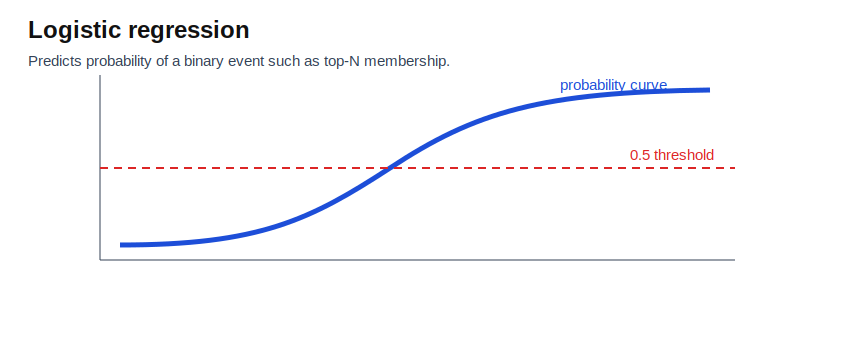

| Field | Value |
| --- | --- |
| Module | `logistic_regression` |
| Returns | Intercept, feature coefficients, odds ratios, pseudo R-squared, and training accuracy. |
| Use when | Predicting binary targets such as `is_top_n` or `event_crossed_100k`. |
| Interpret as | Positive coefficients increase event odds; negative coefficients lower them. |

Logistic regression is for yes/no targets. It is not for predicting a continuous
score directly.

### Naive Bayes

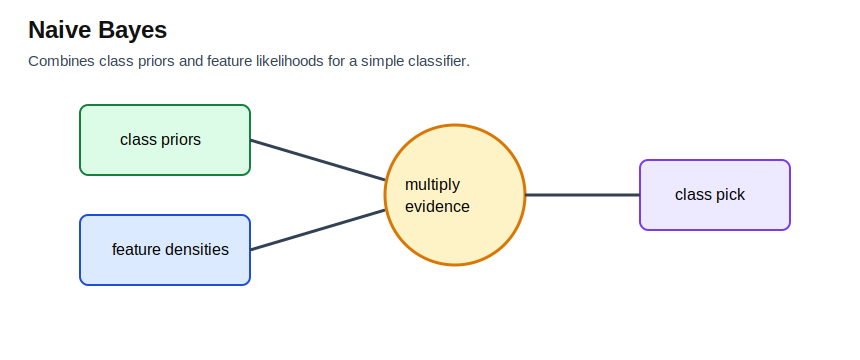

| Field | Value |
| --- | --- |
| Module | `naive_bayes` |
| Returns | Class priors and training accuracy. |
| Use when | Building a simple classifier from numeric features and categorical labels. |
| Interpret as | Priors show class balance; accuracy shows in-sample classification quality. |

Naive Bayes is a transparent baseline. It assumes feature independence, which is
often imperfect but useful for comparison.

### K-Means

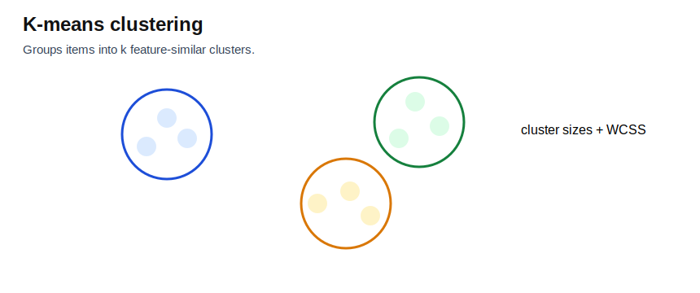

| Field | Value |
| --- | --- |
| Module | `kmeans` |
| Returns | Within-cluster sum of squares and cluster sizes. |
| Use when | Grouping items into feature-similar tiers without labels. |
| Interpret as | Lower within-cluster sum of squares means tighter clusters. |

Uneven cluster sizes may indicate one dominant group plus niche outliers.

### PCA

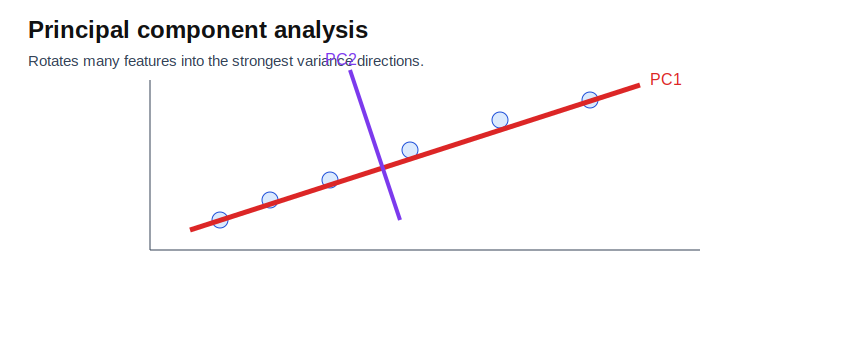

| Field | Value |
| --- | --- |
| Module | `pca` |
| Returns | Variance explained by each principal component and top loadings. |
| Use when | Compressing many related features into fewer dimensions. |
| Interpret as | A high first-component variance ratio means one combined axis explains much of the feature movement. |

PCA helps reveal whether many features are mostly describing the same underlying
direction.

### Kaplan-Meier

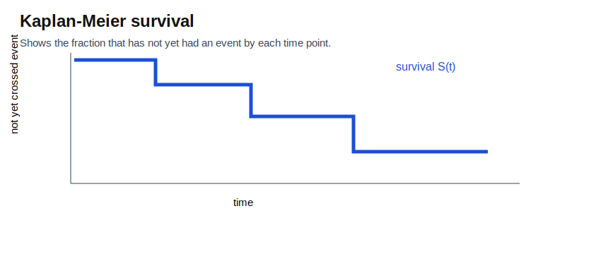

| Field | Value |
| --- | --- |
| Module | `kaplan_meier` |
| Returns | Median survival and survival at a configured horizon. |
| Use when | Estimating time-to-event behavior, such as time until crossing a view threshold. |
| Interpret as | Survival `S(t)` is the estimated fraction that has not had the event by time `t`. |

Kaplan-Meier is useful when not every item has had the event yet. Those items
are treated as still surviving rather than as failures.

## Practical Reading Rules

Prefer medians and IQR when popularity metrics are skewed. Platform view and
engagement data often have a long tail, so one viral item can distort the mean,
range, and standard deviation.

Treat rank-based regressions as quality checks for the result ordering. A clean
`overall` ranking should usually show a downward slope over rank. Other targets
do not have to follow rank; for example, `opportunity` may intentionally surface
lower-popularity items.

Use outliers as review prompts, not automatic errors. An outlier can be a bad
data point, a genuinely important item, or a sign that the query found multiple
types of content.

For fewer than five items, read every number as a rough summary. A single added
or removed item can change the mean, slope, standard deviation, and outlier
status.
